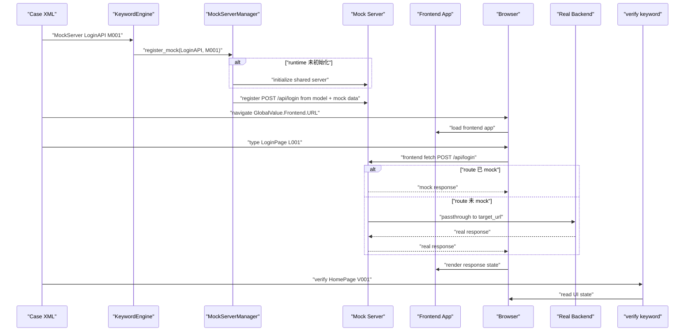
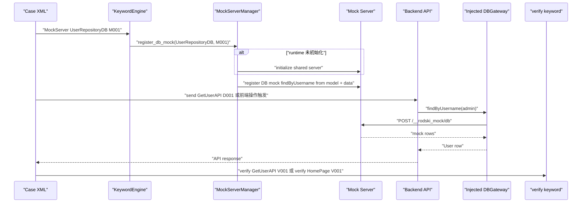

# RodSki v6.2.0 Mock Server 设计讨论稿

**状态**: 讨论稿，未实现  
**目标版本**: v6.2.0  
**创建日期**: 2026-05-04  
**更新日期**: 2026-05-06  
**范围**: `MockServer` 关键字、接口模型自动加载、mock 返回数据、自动路由、passthrough、接口录制  

---

## 1. 结论

v6.2.0 Mock Server 推荐新增一个顶层关键字：

```xml
<test_step action="MockServer" model="LoginAPI" data="M001"/>
```

它符合 RodSki 现有 `action + model + data` 结构，但语义需要严格限定：

- `MockServer` **不是启动服务关键字**。
- `MockServer` 表示：基于 `model.xml` 中某个 interface model，为 mock server 激活或注册该接口的 mock 行为。
- mock server 采用懒加载机制，是框架内部运行时依赖，不是用例显式管理对象；第一个实际需要 mock server 的用例步骤触发启动，同一次 run 内复用同一个 server，所有用例执行结束后统一关闭。
- 接口 method、url、headers、请求字段全部从 `model.xml` 自动推导。
- 用例作者通常只需要维护 mock 返回数据，不需要重复写接口路径和方法。
- 前端项目需要在测试环境中配置 API base URL，使浏览器请求能够连接到 mock server。
- 服务端项目需要在测试环境中通过依赖注入替换 DB 访问组件，使服务端代码请求 mock DB 而不访问真实数据库。
- 后续前端页面发出的服务端请求需要自动路由：已注册接口走 mock server，未注册接口继续走真实后端。
- 没有被 `MockServer` 注册的请求，需要 passthrough 到具体后端，避免 mock server 必须模拟所有接口。
- 同一条测试用例需要可以通过运行配置切换 mock/real/record 模式，不复制 case XML。
- mock server 需要独立记录启动/关闭等生命周期日志，并和接口请求执行日志分离。
- 已有测试用例可以通过录制模式，把真实请求和响应记录成候选 mock 数据。

核心链路：

```xml
<!-- 1. 测试前：配置并启动被测前端项目，使 API base URL 指向 mock server -->
<test_step action="MockServer" model="LoginAPI" data="M001"/>
<test_step action="navigate" model="" data="GlobalValue.Frontend.URL"/>
<test_step action="type" model="LoginPage" data="L001"/>
<test_step action="verify" model="HomePage" data="V001"/>
```

运行时实际链路：

```text
配置被测前端项目 API base URL -> 启动被测前端项目
-> MockServer 注册后端接口 mock，并在首次需要时懒启动 mock server
-> navigate 打开前端页面
-> type 执行前端页面操作
-> 前端浏览器请求 mock server
-> mock server 模拟服务端返回
-> verify 验证前端页面响应
```

服务端测试主链路：

```text
配置被测服务端 DB 访问组件 -> 启动被测服务端项目
-> MockServer 注册 DB mock 数据或 DB gateway 行为
-> send 或前端/UI 操作触发服务端接口
-> 服务端代码通过注入的 DB 组件请求 mock DB
-> mock DB 返回数据
-> verify 验证接口响应或前端页面响应
```

---

## 2. 适用场景与解决的问题

MockServer 用在“被测系统依赖外部服务或 DB，导致自动化测试不稳定、不可控或难复现”的场景。它不替代 RodSki 的 `type/send/verify/DB` 关键字，而是为这些关键字执行的业务链路提供可控依赖。

| 使用场景 | 解决的问题 | 需要的注入点 | RodSki 主链路 |
|---|---|---|---|
| 前端页面测试，后端接口未完成 | 前端可以先测 UI 流程、状态展示、异常提示 | 前端 API base URL 指向 mock server | `MockServer -> navigate -> type -> verify` |
| 前端页面测试，真实后端不稳定 | 避免真实环境数据变化、接口超时、账号状态污染 | 前端 API client / dev proxy / runtime config | `MockServer -> navigate -> type -> verify` |
| 前端只想 mock 少数接口 | 不需要模拟所有后端能力，未注册接口 passthrough 到真实后端 | API base URL 指向 mock server，配置 upstream | `MockServer` 注册少数接口，其他请求 passthrough |
| 同一条用例需要跑 mock 和真实后端 | 不复制 case XML，便于同一用例做稳定回归和真实环境回归 | `mock.mode=mock|real` 运行配置 | 同一 case，切换运行配置 |
| 服务端接口测试，需要 mock DB | 避免访问真实数据库，控制查询结果、空数据、异常、慢查询 | 服务端 Repository / DataSource / DBGateway 注入 | `MockServer -> send -> verify` |
| 前端到服务端全链路测试，但服务端 DB 需要 mock | 前端真实调用服务端，服务端 DB 结果可控 | 前端 API base URL 指向被测服务端，服务端 DBGateway 指向 mock server | `MockServer -> navigate -> type -> verify` |
| 录制真实系统样本 | 从真实请求/响应生成候选 mock 数据，降低手工维护成本 | `mock.mode=record` 或 `_mode=record` | `MockServer(record) -> send/type -> 生成候选数据` |

不建议使用 MockServer 的场景：

- 纯 UI 静态页面验证，没有后端或 DB 依赖。
- 目标就是验证真实后端、真实数据库、真实第三方服务的可用性，且不希望任何依赖被替换。
- 被测前端没有任何 API base URL / proxy / runtime config 注入点，且不能改造。
- 被测服务端没有 DB 访问抽象，所有 SQL 和连接散落在业务代码中，且不能改造。

---

## 3. 和 RodSki 约束的关系

RodSki 当前接口测试规则：

- `send` 负责发送接口请求。
- `verify` 负责验证接口响应。
- 接口模型在 `model.xml` 中定义 `_method`、`_url`、`_header_*` 与业务字段。
- `send ModelName DataID` 从 `data.sqlite` 的 `{ModelName}` 逻辑表读取请求数据。
- `verify ModelName DataID` 从 `{ModelName}_verify` 逻辑表读取期望数据，并与上一步 `send` 的 Return 比较。
- Case XML 的 `data` 只写 DataID，不写 `ModelName.DataID`。
- 接口/DB 的 `_verify` 表中不要使用 `${Return[-1]}`。

`MockServer` 必须遵守同一套结构：

```text
MockServer ModelName DataID
```

默认读取：

```text
{ModelName}_mock.DataID
```

也就是说：

```xml
<test_step action="MockServer" model="LoginAPI" data="M001"/>
```

对应：

```text
model/model.xml 中的 LoginAPI
data/data.sqlite 中的 LoginAPI_mock.M001
```

---

## 4. 关键字语义

### 4.1 `MockServer`

格式：

```xml
<test_step action="MockServer" model="LoginAPI" data="M001"/>
```

字段规则：

| 属性 | 规则 |
|---|---|
| `action` | 固定为 `MockServer` |
| `model` | `model.xml` 中的 HTTP interface 模型，或服务端 DB mock 的 database/db-mock 模型 |
| `data` | DataID，例如 `M001`；不能写 `LoginAPI_mock.M001` |

执行语义：

1. 读取当前 run 的 mock 模式，默认 `mock.mode=mock`。
2. 校验 `model` 是 HTTP interface 模型或 DB mock 模型。
3. 从 `model.xml` 读取接口或 DB mock 的路由元数据。HTTP 模型读取 `_method`、`_url`、`_header_*`、业务字段；DB mock 模型读取 component/query/operation/params 定义。
4. 当 `mock.mode=mock` 时，从 `data.sqlite` 读取 `{ModelName}_mock.{DataID}`。
5. 当 `mock.mode=real` 时，`MockServer` 不注册 mock route；默认不要求 `{ModelName}_mock.{DataID}` 存在。
6. 当 `mock.mode=record` 时，按录制模式读取 `{ModelName}_mock.{DataID}` 中的录制配置。
7. 如果当前模式需要 mock server runtime，且 runtime 未初始化，则框架内部先完成懒加载启动，并写入生命周期日志。
8. 根据模型自动注册或更新 HTTP route / DB mock route。
9. 使用 mock 数据行作为该 route 的响应数据和可选匹配规则。
10. 返回注册结果到 Return。

返回值示例：

```json
{
  "registered": true,
  "mode": "mock",
  "route_id": "LoginAPI.M001",
  "model": "LoginAPI",
  "data_id": "M001",
  "method": "POST",
  "path": "/api/login",
  "base_url": "http://127.0.0.1:9001",
  "target_url": "http://real-backend.example.com/api/login",
  "passthrough": true
}
```

### 4.2 不新增的关键字

不新增：

```xml
<test_step action="start_mock_server" .../>
<test_step action="stop_mock_server" .../>
<test_step action="mock" .../>
<test_step action="http_get" .../>
<test_step action="http_post" .../>
<test_step action="assert_json" .../>
<test_step action="assert_called" .../>
```

其中：

- runtime 初始化只是 `MockServer` 首次注册接口 mock 时的内部副作用，不是独立测试语义。
- 发送请求仍然使用 `send`。
- 验证响应仍然使用 `verify`。
- 验证 mock 请求记录时，使用 Admin API + `send/verify`，而不是新增 `assert_called`。

---

## 5. 生命周期

### 5.1 run 级懒加载共享

默认生命周期是 run 级懒加载共享：

```text
rodski run 开始
  → 不预启动 mock server

第一个实际需要 mock server 的用例步骤
  → 可能是 MockServer 注册 mock route
  → 也可能是前端 UI proxy 模式下需要透明 passthrough
  → mock server runtime 未初始化
  → 框架内部启动共享 mock server
  → 写入 lifecycle.jsonl: server_start_requested / server_started
  → 注册当前接口 route

后续 MockServer 步骤
  → mock server runtime 已初始化
  → 复用同一个 mock server
  → 继续注册新的接口 route

所有用例执行结束
  → SKIExecutor finally 统一关闭 mock server runtime
  → 写入 lifecycle.jsonl: server_stop_requested / server_stopped
```

懒加载触发条件：

- `mock.mode=mock` 且执行到第一条 `MockServer` 注册步骤。
- `mock.mode=record` 且执行到第一条 `MockServer` 录制步骤。
- `mock.mode=real` 且 `disabled_behavior=proxy_passthrough`，前端 API base_url 固定指向 mock server，需要 mock server 作为透明代理。

不触发启动的情况：

- `mock.mode=real` 且 `disabled_behavior=noop`。
- 当前执行的 case 集合没有任何 `MockServer` 步骤，也没有 UI proxy 需求。

### 5.2 用例不负责停止服务

Case XML 通常不写停止步骤。

框架需要兜底：

```text
try:
    execute_all_cases()
finally:
    mock_server_manager.stop_all_if_started()
```

原因：

- 用例失败时仍需释放端口。
- 按 tag 执行时，清理用例可能不会执行。
- `MockServer` 是运行时资源，清理由框架保证。
- mock server 未被懒加载启动时，`stop_all_if_started()` 不能报错，只记录 `server_not_started` 或不写关闭事件。

### 5.3 同一用例的 mock 开关

同一条 case XML 可以同时支持 mock 和非 mock 执行。case 中保留 `MockServer` 步骤，是否真正注册 mock route 由运行配置决定。

推荐模式：

| 模式 | 行为 | 适用场景 |
|---|---|---|
| `mock.mode=mock` | `MockServer` 注册 mock route，请求命中后返回 `{ModelName}_mock` 数据 | 稳定前端/UI/API 自动化 |
| `mock.mode=real` | `MockServer` 步骤 no-op，不注册 mock route，请求走真实后端 | 同一用例跑真实后端回归 |
| `mock.mode=record` | `MockServer` 注册录制 route，请求 passthrough 到真实后端并生成候选 mock 数据 | 从真实系统采集 mock 数据 |

同一条 XML：

```xml
<case execute="是" id="TC042" title="登录接口可切换 Mock/Real 测试" priority="P0" tags="api,mock-switch">
    <pre_process>
        <test_step action="MockServer" model="LoginAPI" data="M001"/>
    </pre_process>

    <test_case>
        <test_step action="send" model="LoginAPI" data="D001"/>
        <test_step action="verify" model="LoginAPI" data="V001"/>
    </test_case>
</case>
```

mock 模式：

```yaml
mock:
  mode: mock
```

real 模式：

```yaml
mock:
  mode: real
```

`mock.mode=real` 时：

- `MockServer LoginAPI M001` 返回 `registered=false`、`skipped=true`、`mode=real`。
- `send LoginAPI D001` 按现有接口模型请求真实 `_url`。
- 前端 UI 测试如果 API base_url 指向真实后端，不需要初始化 mock server runtime。
- 前端 UI 测试如果 API base_url 固定指向 mock server，可以使用 `disabled_behavior=proxy_passthrough`，让 mock server 作为透明代理只做 passthrough。

real 模式返回值示例：

```json
{
  "registered": false,
  "skipped": true,
  "mode": "real",
  "model": "LoginAPI",
  "data_id": "M001",
  "reason": "mock disabled by run config"
}
```

设计约束：

- 不新增 `MockOn`、`MockOff`、`start_mock_server`、`stop_mock_server` 关键字。
- 不要求复制两份 case XML。
- mock 开关是运行配置，不是测试步骤语义。
- `mock.mode=mock` 下缺少 `{ModelName}_mock.DataID` 必须失败。
- `mock.mode=real` 下默认不校验 mock 数据行，避免真实后端回归被 mock 数据缺失阻断。

验证数据需要单独处理：

- 如果 mock 后端和真实后端返回协议及核心字段一致，同一条 `verify ModelName V001` 可以复用同一个 `{ModelName}_verify.V001`。
- 如果真实后端会返回不同 token、id、时间戳、环境名等字段，建议把 `verify` 数据拆成稳定字段，避免断言动态值。
- 如果确实需要 mock/real 使用不同期望数据，P1 可支持运行配置做 DataID 映射，而不是复制 case XML。

DataID 映射示例：

```yaml
mock:
  mode: real
  data_overrides:
    LoginAPI_verify:
      V001: V001_REAL
```

执行时 case XML 仍写：

```xml
<test_step action="verify" model="LoginAPI" data="V001"/>
```

框架在读取 `{ModelName}_verify` 前把 `V001` 映射为 `V001_REAL`。该能力只改变数据选择，不改变步骤语义。

---

## 6. 时序



服务端 DB mock 时序：



---

## 7. model.xml 写法

接口模型继续定义真实后端接口，不需要把 `_url` 改成 `${mock.base_url}`。

```xml
<model name="LoginAPI" type="interface" servicename="">
    <element name="_method" type="http_method">
        <location type="static">POST</location>
    </element>
    <element name="_url" type="http_url">
        <location type="static">http://real-backend.example.com/api/login</location>
    </element>
    <element name="_header_Content-Type" type="field">
        <location type="static">application/json</location>
    </element>
    <element name="username" type="field">
        <location type="field">username</location>
    </element>
    <element name="password" type="field">
        <location type="field">password</location>
    </element>
</model>
```

`MockServer LoginAPI M001` 自动推导：

```text
method = POST
target_url = http://real-backend.example.com/api/login
target_host = real-backend.example.com
path = /api/login
request fields = username, password
```

`send LoginAPI D001` 仍然按现有模型语义组装请求。路由层决定是否转到 mock server。

路由判断不需要在 case XML 中写新的目标地址：

```text
MockServer LoginAPI M001
  → registry 增加 LoginAPI 的 POST /api/login mock route

send LoginAPI D001
  → 命中 LoginAPI route，转发到 mock server 并返回 mock 数据

send OrderAPI D001
  → OrderAPI 未注册 MockServer，继续请求 OrderAPI model._url 指向的真实后端
```

---

## 8. data.sqlite 写法

### 8.1 请求输入表

逻辑表：`LoginAPI`

| id | username | password |
|---|---|---|
| D001 | admin | 123456 |
| D002 | admin | wrong |

用于：

```xml
<test_step action="send" model="LoginAPI" data="D001"/>
```

### 8.2 mock 返回表

逻辑表：`LoginAPI_mock`

| id | _match_username | _match_password | status | token | username | role | message |
|---|---|---|---:|---|---|---|---|
| M001 | admin | 123456 | 200 | mock-token-001 | admin | tester | login ok |
| M002 | admin | wrong | 401 | NONE | admin | NONE | password error |

用于：

```xml
<test_step action="MockServer" model="LoginAPI" data="M001"/>
```

规则：

- 表名固定为 `{ModelName}_mock`。
- `status` 表示 HTTP 状态码，不进入 JSON 响应体。
- `_match_*` 字段用于请求匹配，不进入 JSON 响应体。
- 普通字段进入 JSON 响应体。
- `NONE` 表示字段不进入响应体。
- `BLANK` 表示响应字段为空字符串。
- `NULL` 表示响应字段为 JSON null。

`LoginAPI_mock.M001` 生成响应：

```json
{
  "token": "mock-token-001",
  "username": "admin",
  "role": "tester",
  "message": "login ok"
}
```

HTTP 状态码为 `200`。

### 8.3 响应验证表

逻辑表：`LoginAPI_verify`

| id | status | token | username | role | message |
|---|---:|---|---|---|---|
| V001 | 200 | mock-token-001 | admin | tester | login ok |

用于：

```xml
<test_step action="verify" model="LoginAPI" data="V001"/>
```

规则：

- `_verify` 表不要写 `${Return[-1]}`。
- `verify` 会自动从上一步 `send` 的 Return 读取实际值。
- `status` 验证 HTTP 状态码。

### 8.4 复杂响应

复杂响应可以先用 JSON 字符串字段：

| id | status | data | message |
|---|---:|---|---|
| M001 | 200 | `{"orders":[{"id":"O001","amount":100}]}` | ok |

P1 可支持 fixture 字段：

| id | status | _fixture |
|---|---:|---|
| M001 | 200 | `mock/fixtures/orders_ok.json` |

如果存在 `_fixture`：

- 响应 body 从 fixture 读取。
- `status` 仍从当前行读取。
- 其他普通字段是否合并进响应，建议 P0 不合并，避免歧义。

---

## 9. Case XML 写法

### 9.1 单接口 mock

```xml
<cases>
    <case execute="是" id="TC042" title="Mock 登录接口测试" priority="P0" tags="mock,api">
        <pre_process>
            <test_step action="MockServer" model="LoginAPI" data="M001"/>
        </pre_process>

        <test_case>
            <test_step action="send" model="LoginAPI" data="D001"/>
            <test_step action="verify" model="LoginAPI" data="V001"/>
        </test_case>
    </case>
</cases>
```

### 9.2 多接口 mock

```xml
<cases>
    <case execute="是" id="TC043" title="Mock 登录后查询订单" priority="P0" tags="mock,api">
        <pre_process>
            <test_step action="MockServer" model="LoginAPI" data="M001"/>
            <test_step action="MockServer" model="OrderAPI" data="M001"/>
        </pre_process>

        <test_case>
            <test_step action="send" model="LoginAPI" data="D001"/>
            <test_step action="verify" model="LoginAPI" data="V001"/>
            <test_step action="send" model="OrderAPI" data="D001"/>
            <test_step action="verify" model="OrderAPI" data="V001"/>
        </test_case>
    </case>
</cases>
```

### 9.3 部分 mock，其他接口 passthrough

```xml
<case execute="是" id="TC044" title="只 Mock 登录，订单走真实后端" priority="P1" tags="mock,api">
    <pre_process>
        <test_step action="MockServer" model="LoginAPI" data="M001"/>
    </pre_process>

    <test_case>
        <test_step action="send" model="LoginAPI" data="D001"/>
        <test_step action="verify" model="LoginAPI" data="V001"/>

        <!-- OrderAPI 没有注册 MockServer，因此 passthrough 到真实后端 -->
        <test_step action="send" model="OrderAPI" data="D001"/>
        <test_step action="verify" model="OrderAPI" data="V001"/>
    </test_case>
</case>
```

---

## 10. 基础组件注入

Mock Server 能力本质上不是“用例启动服务”，而是让被测系统在测试环境中把外部依赖接到可控的 mock 组件上。前端和服务端都需要清晰的注入点。

### 10.1 前端项目注入

前端项目需要有一个可配置的 API client 或 API base URL。测试环境启动前端时，把后端地址指向 mock server。

推荐注入点：

| 前端类型 | 注入方式 | 示例 |
|---|---|---|
| Vite / Vue / React | 环境变量 | `VITE_API_BASE_URL=http://127.0.0.1:9001` |
| Next.js / Nuxt | runtime config 或 public env | `NEXT_PUBLIC_API_BASE_URL=http://127.0.0.1:9001` |
| 传统静态前端 | `window.__APP_CONFIG__` | `apiBaseUrl: "http://127.0.0.1:9001"` |
| dev server | proxy 配置 | `/api -> http://127.0.0.1:9001` |

前端代码建议统一封装 API client：

```typescript
const apiBaseUrl =
  window.__APP_CONFIG__?.apiBaseUrl ||
  import.meta.env.VITE_API_BASE_URL ||
  process.env.NEXT_PUBLIC_API_BASE_URL;

export const apiClient = createHttpClient({
  baseURL: apiBaseUrl,
  withCredentials: true,
});
```

测试配置：

```yaml
frontend:
  url: http://127.0.0.1:5173
  api_base_url: http://127.0.0.1:9001
  inject:
    type: env
    key: VITE_API_BASE_URL
```

RodSki case 只负责执行前端动作：

```xml
<test_step action="MockServer" model="LoginAPI" data="M001"/>
<test_step action="navigate" model="" data="GlobalValue.Frontend.URL"/>
<test_step action="type" model="LoginPage" data="L001"/>
<test_step action="verify" model="HomePage" data="V001"/>
```

### 10.2 服务端 DB 依赖注入

服务端测试的主要目标不是 mock HTTP，而是 mock 掉服务端对 DB 的访问。服务端项目需要把 DB 访问封装为可替换组件，例如 `DataSource`、`Repository`、`DAO`、`DBClient` 或 `DBGateway`。

推荐注入边界：

```text
Controller / Handler
  -> Service
  -> Repository / DBGateway   # 测试时替换这里
  -> Real DB
```

测试环境替换为：

```text
Controller / Handler
  -> Service
  -> MockDBGateway
  -> mock server / mock data
```

推荐注入方式：

| 服务端类型 | 注入方式 | 说明 |
|---|---|---|
| Spring / NestJS / FastAPI / Express 分层应用 | DI container 替换 repository/provider | 测试 profile 中绑定 mock 实现 |
| 直接使用数据库连接池 | 环境变量替换 DSN | `DATABASE_URL=mockdb://127.0.0.1:9001/orders` |
| 无 DI 的旧项目 | 包一层 DBGateway | 先把散落 SQL 收敛到网关，再切换 real/mock |
| 本地集成测试 | test profile | `APP_PROFILE=test-mock-db` |

服务端代码建议保留明确接口：

```typescript
interface UserRepository {
  findByUsername(username: string): Promise<User | null>;
}

class RealUserRepository implements UserRepository {
  constructor(private db: DatabaseClient) {}
}

class MockUserRepository implements UserRepository {
  constructor(private mockDbClient: MockDbClient) {}
}
```

测试配置：

```yaml
backend:
  url: http://127.0.0.1:8080
  profile: test-mock-db
  db_injection:
    component: UserRepository
    mode: mock
    endpoint: http://127.0.0.1:9001/__rodski_mock/db
```

DB mock 数据仍建议复用 RodSki 的 `model + data` 思路：

```xml
<test_step action="MockServer" model="UserRepositoryDB" data="M001"/>
```

其中 `UserRepositoryDB` 是 `model.xml` 中的 database 或 db-mock 模型，`UserRepositoryDB_mock.M001` 定义 DB 查询入参匹配和返回行。

### 10.3 注入责任边界

| 层 | 责任 |
|---|---|
| 被测前端项目 | 暴露 API base URL 配置点，所有请求走统一 API client |
| 被测服务端项目 | 暴露 DB 访问组件替换点，所有 DB 请求走 Repository/DBGateway |
| RodSki case XML | 用 `MockServer model data` 激活 mock 数据，用 `navigate/type/verify` 或 `send/verify` 执行业务测试 |
| MockServer runtime | 根据 model 自动注册 HTTP/DB mock 行为，记录生命周期和执行日志 |
| `mock/config.yaml` / GlobalValue | 控制 mock/real/record 模式、前端 URL、API base URL、后端 profile、DB 注入配置 |

禁止做法：

- 前端代码里到处硬编码真实后端地址，导致测试时无法统一切到 mock server。
- 服务端业务代码直接散落 SQL 或全局 DB 连接，导致测试时无法替换 DB 访问。
- 在 Case XML 中新增 `StartFrontend`、`StartBackend`、`MockDBOn` 等专用关键字。
- 用 RodSki 直接改被测项目源码来切换 mock；应通过测试 profile、环境变量或配置文件注入。

---

## 11. 自动路由与 passthrough

### 11.1 前端浏览器代理路由

P0 主路径是前端浏览器代理路由。`type` 操作前端页面后，浏览器发出的请求进入 mock server：

```text
前端 API client baseURL = mock server base_url
→ type 操作触发浏览器 fetch/XHR
→ mock server 查询 registry
→ method + normalized_path + matcher 命中已注册 mock route，返回 mock 数据
→ 未命中则按 upstream 映射 passthrough 到真实后端
```

浏览器请求不会携带 RodSki `model_name`。因此 UI proxy 的 route key 建议包含：

```text
service_name + method + normalized_path + query/body/header matcher
```

`model_name` 只作为 route 来源和诊断字段保留，不作为浏览器请求命中的必要条件。

### 11.2 send 请求层路由

`send` 请求层路由作为接口测试和调试辅助。`send` 的 XML 写法不变，仍然是原始接口 model；路由层根据当前 run 的 `MockServer` registry 决定去向：

```text
send 组装真实请求 URL
→ 查询 MockServer registry
→ 如果 model + method + path 命中已注册 mock route，则改发到 mock server
→ 如果未命中，则 passthrough 到真实 URL
```

registry 的 key 建议包含：

```text
module_id + model_name + method + normalized_path
```

其中 `model_name` 用于避免不同 model 共用同一路径时互相误命中；`normalized_path` 用于处理 query 参数顺序、尾斜杠等格式差异。

### 11.3 DB mock 路由

服务端 DB mock 路由由注入的 DBGateway 或 MockDBClient 访问 mock server 的 DB mock endpoint：

```text
服务端 Repository/DBGateway
→ MockDBClient 请求 mock server /__rodski_mock/db
→ mock server 根据 db model + query name + params 匹配 mock 数据
→ 返回 rows / affected_rows / error
```

DB mock route key 建议包含：

```text
component_name + operation + query_name + params matcher
```

例如：

```text
UserRepositoryDB + query + findByUsername + username=admin
```

DB mock 返回值建议写在 `{ModelName}_mock`：

| id | _operation | _query | _match_username | rows |
|---|---|---|---|---|
| M001 | query | findByUsername | admin | `[{"id":1,"username":"admin","role":"tester"}]` |

### 11.4 passthrough 默认规则

```text
已注册 mock route → 返回 mock 数据
未注册 route → 转发到 model _url 的真实后端
passthrough 失败 → 返回真实错误，并记录失败
```

可配置项：

| 配置 | 默认 | 说明 |
|---|---|---|
| `passthrough.enabled` | `true` | 未 mock 请求是否放行到真实后端 |
| `passthrough.timeout` | `30` | 转发超时 |
| `passthrough.record` | `true` | 是否记录真实请求/响应 |
| `unmatched.mode` | `passthrough` | `passthrough` / `404` / `fail` |

### 11.5 安全边界

- 默认只绑定 `127.0.0.1`。
- passthrough 只允许转发到 model `_url` 声明的 host。
- 禁止把未声明 host 作为转发目标。
- 所有 passthrough 请求写入 journal。

---

## 12. 接口录制

### 12.1 目标

基于已有测试用例，自动录制真实接口的请求和返回信息，生成可转化为 `{ModelName}_mock` 的候选数据。

录制用途：

- 从真实系统生成 mock 返回样本。
- 帮助 AI Agent 或测试人员补齐 mock 数据。
- 避免手工填写大量响应字段。

### 12.2 录制模式仍然使用 `MockServer model + data`

录制不是新的 HTTP 关键字。建议仍使用 `MockServer`：

```xml
<test_step action="MockServer" model="LoginAPI" data="R001"/>
<test_step action="send" model="LoginAPI" data="D001"/>
```

`LoginAPI_mock.R001`：

| id | _mode | _record_to | _passthrough |
|---|---|---|---|
| R001 | record | M001 | true |

语义：

- 注册 `LoginAPI` 为录制 route。
- 请求先 passthrough 到真实后端。
- 记录请求和真实响应。
- 生成候选 mock 行 `LoginAPI_mock.M001`。
- 默认不直接改写 `data.sqlite`，只写入 result 目录中的录制产物。

### 12.3 录制产物

建议写入：

```text
result/rodski_*/mock/recordings/LoginAPI.R001.request.json
result/rodski_*/mock/recordings/LoginAPI.R001.response.json
result/rodski_*/mock/recordings/LoginAPI.R001.mock_row.json
result/rodski_*/mock/recordings/suggested_mock_tables.json
```

`mock_row.json` 示例：

```json
{
  "table": "LoginAPI_mock",
  "id": "M001",
  "fields": {
    "status": "200",
    "token": "real-token-sanitized",
    "username": "admin",
    "message": "login ok"
  }
}
```

### 12.4 敏感数据处理

录制默认需要脱敏：

- header 中的 `Authorization`、`Cookie`、`Set-Cookie`。
- 字段名包含 `password`、`token`、`secret`、`key`。
- 可通过配置指定额外脱敏字段。

默认不把真实 token 直接写回 `data.sqlite`。

### 12.5 从已有用例生成录制计划

已有用例里通常已经有：

```xml
<test_step action="send" model="LoginAPI" data="D001"/>
```

可以由工具或 Agent 根据 case XML 自动生成临时录制步骤：

```xml
<test_step action="MockServer" model="LoginAPI" data="R001"/>
<test_step action="send" model="LoginAPI" data="D001"/>
```

或者生成一个录制版 case 副本。该能力属于 P1/P2，不在 P0 强制实现。

---

## 13. 目录结构

P0 可以不要求 `mock/mock.yaml` 写 route，因为 route 来自 model，返回数据来自 data.sqlite。

推荐目录：

```text
MyTestModule/
├── case/
├── model/
│   └── model.xml
├── data/
│   ├── data.sqlite
│   └── globalvalue.xml
├── mock/
│   ├── config.yaml        # 可选：server/passthrough/record 配置
│   └── fixtures/          # 可选：复杂响应体
└── result/
    └── rodski_*/
        └── mock/
            ├── server.json
            ├── lifecycle.jsonl
            ├── requests.jsonl
            ├── passthrough.jsonl
            ├── unmatched.jsonl
            ├── summary.json
            └── recordings/
```

`mock/config.yaml` 示例：

```yaml
mock:
  mode: mock              # mock / real / record
  disabled_behavior: noop # noop / proxy_passthrough

server:
  host: 127.0.0.1
  port: 9001

passthrough:
  enabled: true
  timeout: 30
  record: true

recording:
  redact_fields:
    - password
    - token
    - Authorization
```

---

## 14. Admin API 与请求验证

如果需要验证 mock server 是否收到某请求，不新增 `assert_called`。使用 Admin API + `send/verify`。

Admin API：

```text
GET  /__rodski_mock/health
GET  /__rodski_mock/summary
GET  /__rodski_mock/requests
POST /__rodski_mock/reset
```

Admin API 也可以定义 interface model：

```xml
<model name="MockSummaryAPI" type="interface" servicename="">
    <element name="_method" type="http_method">
        <location type="static">GET</location>
    </element>
    <element name="_url" type="http_url">
        <location type="static">http://127.0.0.1:9001/__rodski_mock/summary</location>
    </element>
</model>
```

Case：

```xml
<test_step action="send" model="MockSummaryAPI" data="D001"/>
<test_step action="verify" model="MockSummaryAPI" data="V001"/>
```

---

## 15. 运行结果与诊断

Mock Server 诊断证据分为两类：

- 启动/关闭生命周期日志：记录 mock server runtime 何时被懒加载启动、监听地址、端口、关闭原因和耗时。
- 接口执行日志：记录 route 注册、请求命中、passthrough、未匹配请求和录制结果。

文件：

```text
result/rodski_*/mock/server.json
result/rodski_*/mock/lifecycle.jsonl
result/rodski_*/mock/requests.jsonl
result/rodski_*/mock/passthrough.jsonl
result/rodski_*/mock/unmatched.jsonl
result/rodski_*/mock/summary.json
```

`server.json`：

```json
{
  "started": true,
  "lazy_loaded": true,
  "base_url": "http://127.0.0.1:9001",
  "started_by_case_id": "TC042",
  "started_by_step": "MockServer LoginAPI M001",
  "passthrough": true
}
```

`lifecycle.jsonl` 单行：

```json
{"event":"server_start_requested","run_id":"20260506_120001","case_id":"TC042","step":"MockServer LoginAPI M001","mode":"mock","timestamp":"2026-05-06T12:00:01+08:00"}
```

```json
{"event":"server_started","run_id":"20260506_120001","base_url":"http://127.0.0.1:9001","host":"127.0.0.1","port":9001,"pid":12345,"elapsed_ms":83,"timestamp":"2026-05-06T12:00:01+08:00"}
```

```json
{"event":"server_stop_requested","run_id":"20260506_120001","reason":"run_finished","timestamp":"2026-05-06T12:03:10+08:00"}
```

```json
{"event":"server_stopped","run_id":"20260506_120001","elapsed_ms":31,"timestamp":"2026-05-06T12:03:10+08:00"}
```

`requests.jsonl` 单行：

```json
{"case_id":"TC042","route_id":"LoginAPI.M001","method":"POST","path":"/api/login","matched":true,"response_status":200}
```

`passthrough.jsonl` 单行：

```json
{"case_id":"TC044","model":"OrderAPI","method":"GET","target_url":"http://real-backend.example.com/api/orders","response_status":200}
```

---

## 16. Schema 和文档影响

后续实现时需要同步：

- `rodski/schemas/case.xsd`：`ActionType` 增加 `MockServer`。
- `KeywordEngine.SUPPORTED`：增加 `MockServer`。
- `CORE_DESIGN_CONSTRAINTS.md`：更新关键字清单，说明 `MockServer` 是运行时 mock 注册关键字，不是 HTTP 请求关键字。
- `TEST_CASE_WRITING_GUIDE.md`：新增 Mock Server 写法，强调前端 UI 主链路是 `MockServer + navigate + type + verify`，接口调试链路才使用 `send + verify`。
- `DATA_FILE_ORGANIZATION.md`：说明 `{ModelName}_mock` 逻辑表。
- 前端项目接入指南：说明 API client / API base URL 注入方式。
- 服务端项目接入指南：说明 DBGateway / Repository / DataSource 注入方式。

---

## 17. P0 / P1 / P2

### P0

- `MockServer ModelName DataID`。
- `{ModelName}_mock` 数据表读取。
- 从 interface model 自动推导 method/path/target_url。
- 前端 API base URL 注入指导，支持被测前端项目连接 mock server。
- 服务端 DBGateway / Repository / DataSource 注入指导，支持 mock 掉 DB 请求。
- 支持同一条 case 通过 `mock.mode=mock|real` 切换 mock 或真实后端。
- `mock.mode=real` 时 `MockServer` no-op，默认不校验 mock 数据行。
- mock server run 级懒加载：rodski run 开始不预启动，第一个实际需要 mock server 的用例步骤触发启动。
- 同 run 复用同一个 mock server。
- 前端浏览器请求自动路由到 mock server。
- DB mock 请求通过注入的 DBGateway / MockDBClient 路由到 mock server。
- `send` 请求层作为接口调试辅助路由到 mock server。
- 未注册接口 passthrough 到真实后端。
- 所有用例执行结束后，run 结束兜底关闭并释放 mock server runtime。
- 独立生命周期日志 `lifecycle.jsonl`。
- 独立执行日志 requests/passthrough/unmatched/summary。
- demo：一个前端 UI mock 后端接口、一个服务端 mock DB 请求、一个 passthrough。

### P1

- Admin API。
- 录制模式 `_mode=record`。
- `mock.mode=record` 运行级录制模式。
- `disabled_behavior=proxy_passthrough`，用于前端 API base URL 固定指向 mock server 但本次要跑真实后端的场景。
- 录制产物生成候选 `{ModelName}_mock` 行。
- fixture 响应。
- case 级 reset/strict。
- 更复杂的 UI 应用 API base URL 代理模式。

### P2

- 自动生成录制版 case。
- 多服务命名空间。
- stateful scenario。
- response template。
- 从 OpenAPI 辅助生成 interface model 和 mock row 草案。

---

## 18. 开放问题

1. `MockServer` 的 action 大小写是否固定为 `MockServer`？
   - 建议固定，避免和普通 `mock` 概念混淆。

2. mock 表名是否固定为 `{ModelName}_mock`？
   - 建议固定，保持和 `{ModelName}_verify` 对称。

3. passthrough 是否默认开启？
   - 当前用户目标是避免模拟过多接口，建议默认开启。

4. P0 是否允许 `port=0`？
   - CI 并行需要；本地调试固定 9001 更直观。可作为 P1。

5. 录制结果是否直接写回 `data.sqlite`？
   - 建议默认不直接写回，只生成 result 下候选数据，避免测试运行修改源码数据。

6. mock 开关是否应该放在 case XML？
   - 建议不放。保持同一条 case XML 不变，通过运行配置 `mock.mode` 控制 mock/real/record，避免引入新的条件执行语法。

---

## 19. 最终推荐写法

```xml
<case execute="是" id="TC042" title="前端登录页 Mock/Real 可切换测试" priority="P0" tags="mock,ui">
    <pre_process>
        <test_step action="MockServer" model="LoginAPI" data="M001"/>
        <test_step action="navigate" model="" data="GlobalValue.Frontend.URL"/>
    </pre_process>

    <test_case>
        <test_step action="type" model="LoginPage" data="L001"/>
        <test_step action="verify" model="HomePage" data="V001"/>
    </test_case>
</case>
```

前端项目测试配置：

```yaml
frontend:
  url: http://127.0.0.1:5173
  api_base_url: http://127.0.0.1:9001
  inject:
    type: env
    key: VITE_API_BASE_URL
```

服务端 DB mock 示例：

```xml
<case execute="是" id="TC_DB_001" title="服务端查询用户时 Mock DB" priority="P0" tags="mock,backend,db">
    <pre_process>
        <test_step action="MockServer" model="UserRepositoryDB" data="M001"/>
    </pre_process>

    <test_case>
        <test_step action="send" model="GetUserAPI" data="D001"/>
        <test_step action="verify" model="GetUserAPI" data="V001"/>
    </test_case>
</case>
```

服务端项目测试配置：

```yaml
backend:
  url: http://127.0.0.1:8080
  profile: test-mock-db
  db_injection:
    component: UserRepository
    mode: mock
    endpoint: http://127.0.0.1:9001/__rodski_mock/db
```

同一条 case 的两种运行配置：

```yaml
# mock 后端模式
mock:
  mode: mock
```

```yaml
# 真实后端模式
mock:
  mode: real
```

这个方案满足：

- `MockServer` 是 RodSki 风格的 `action + model + data`。
- 它激活或注册的是“某接口的 mock 行为”，不是显式启动服务。
- 接口定义自动来自 model。
- mock 返回数据来自 `{ModelName}_mock`。
- 同一条用例可以通过 `mock.mode` 在 mock 后端和真实后端之间切换。
- 前端用例通过 `type` 触发浏览器请求，浏览器请求自动路由到 mock server。
- 服务端用例通过注入 DB 组件，把 DB 请求路由到 mock server。
- 未 mock 的请求 passthrough 到真实后端。
- 可以基于已有用例录制真实请求和响应，生成候选 mock 数据。
