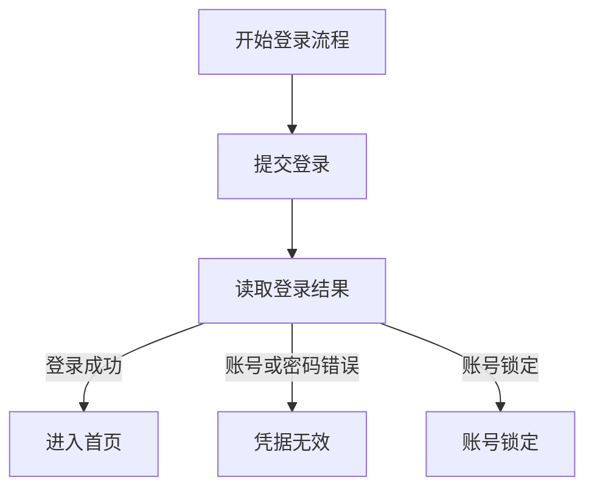
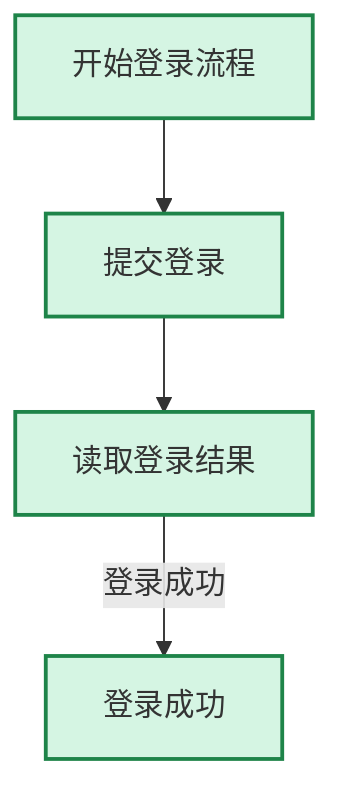

# RodSki 业务模型设计稿 v0.1

**状态**：特性验收完成（v0.1；项目级核心约束待评审晋升）
**日期**：2026-09-27
**适用范围**：RodSki 主仓库与 `rodski-demo/` 验收体系
**本次修订重点**：明确业务模型的两种复用方式、Case 显式选择业务流的约束，以及“业务模型默认不能独立正式执行、CLI 独立运行仅用于调试”的定位。

**关联文档**：

- `rodski/docs/CORE_DESIGN_CONSTRAINTS.md`
- `rodski/docs/TEST_CASE_WRITING_GUIDE.md`
- `rodski/docs/AGENT_INTEGRATION.md`
- `rodski/docs/ARCHITECTURE.md`
- `rodski/docs/DATA_FILE_ORGANIZATION.md`
- `.pb/specs/return_value_unified_design.md`
- `agent.md`

> 本文仍是 v0.1 特性设计与验收依据，但核心执行闭环已经进入实现阶段。当前已经落地 `business.xsd`、Case 中的 `business_call`、SQLite Data/Verify 读取、真实条件分支、路径/字段断言、结果写入、静态校验、Mermaid/JSON 图输出、coverage 汇总和独立 debug CLI。本文尚未晋升为项目级核心设计约束。

**当前实现基线（2026-09-27）**：

- 已支持：`business/business.xml` 目录发现、Case 的 `pre_process`/`test_case`/`post_process` 中的 `business_call`、必填 `ref + flow + input + expect`、普通 SQLite Data/Verify 表、真实条件选边、`actual_path`/`expected_path`/字段断言、`business_result` 结果扩展和 `business debug`。
- 已验收 Demo 资产：`F_LOGIN_SUCCESS`、`F_LOGIN_INVALID`、`F_LOGIN_LOCKED` 三条正式 Case 均有对应数据；`expected_path_mismatch.xml` 是隔离的预期失败样例。统一验收脚本已实际通过，三条正式 Case 3/3 PASS，负向样例按预期 FAIL，节点/边/flow 覆盖分别为 6/6、5/5、3/3。
- 当前 CLI 已提供：`business list`、`business flow-list`（别名 `flows`）、`business validate`、`business graph`、`business coverage` 和 `business debug`；跨文件 Case 引用、action-model 兼容性、完整 trace/稳定错误码仍未纳入 v0.1 完成门禁。
- 本轮自动化复核：专项/兼容测试共 163 项通过；`demo_business_model/acceptance.py` 退出码为 0；`demo_full` 默认回归 19/19 PASS、退出码为 0。完整 pytest 收集仍受既有可选依赖 `cv2`、`PIL`、`appium`、`lxml` 缺失影响；项目级 `CORE_DESIGN_CONSTRAINTS.md` 尚未修改，等待设计评审后择要晋升。

---

## 1. 背景与问题

RodSki 当前采用：

```text
Case 流程
  + action 关键字
  + model.xml 执行模型
  + data/data.sqlite 数据表
  + result 结果
```

当前 `model` 的职责是描述**执行对象**：

- Web/UI 元素与定位器；
- 接口请求字段、URL、方法和 Header；
- 数据库连接和字段；
- 其他驱动所需的可执行对象。

当前模型能够很好地解决“如何对某个页面、接口或数据库执行一个动作”，但不适合直接表达“登录、创建订单、审批、注销”等可复用业务流程。重复业务流程时，Case 只能再次编排一组 `test_step`，容易产生以下问题：

1. 相同业务流程在多个 Case 中重复书写。
2. 流程步骤、前置数据、期望输出分散在 Case、Model 和 Data 中，业务意图不集中。
3. Agent 不容易从现有 Case 中识别可复用的业务流程边界。
4. 复杂流程以线性 XML 表达时，分支关系不直观，不方便生成或查看流程图。
5. 只描述步骤复用，无法明确表达基本流、备选流、异常流和边界流。
6. 流程路径、路径覆盖情况和场景数据没有统一的数据契约。
7. 测试初始化、测试数据构建、业务操作和清理过程缺少统一的可复用抽象。

因此需要引入一个与当前 `model.xml` 明确区分的概念：**业务模型（Business Model / Business Flow Model）**。

本次修订进一步明确：

> **业务模型用于结构化描述黑盒测试场景法中的业务流程和可选路径。**
>
> 它先描述业务可能发生的完整流程图，再由测试用例显式选择要验证的业务流，并提供能触发该路径的输入和期望结果。业务模型既可承载一个完整业务的多路径测试设计，也可作为被其他测试用例引用的通用业务模块；正式执行始终由 Case 发起。

---

## 2. 核心定义

### 2.1 业务模型是什么

业务模型（Business Model）描述一项业务的**完整可能流程图**：有哪些业务节点、哪些业务规则决定节点间转移、有哪些结束状态。它定义业务本身的行为，不负责决定某次测试要覆盖哪条路径。

业务模型有两种使用方式：

1. **完整业务的场景法测试设计**：模型覆盖一项业务的基本流、备选流、异常流和边界流；为各条待验证业务流分别设计 RodSki Case 和测试数据。测试这项完整业务，意味着执行覆盖其不同路径的一组 Case，而不是让一个无测试意图的流程定义自行运行。
2. **通用业务模块复用**：其他 RodSki Case 引用业务模型，并在调用处显式指定要执行的业务流 ID，提供该流所需的输入数据，并声明期望结果。不同 Case 可以复用同一模型的不同业务流。

必须区分以下概念：

```text
Business Model / Flow Graph：业务可能经过的完整有向图，以及业务判断条件
Business Flow / Path：图中定义、可供 Case 选择的一段有稳定 ID 的业务流
Test Case：本次测试意图；必须明确引用一个业务模型和其中一个业务流
Test Data：Case 提供的输入值，业务节点按实际业务条件据此选择后继
Expected Result：Case 声明的期望路径/结果，仅用于执行后的断言
```

业务模型的最小正式执行闭环是：

```text
Case 显式选择 business_model + flow
    → Case 提供输入和期望
    → 流程图按业务判断条件自然执行
    → 记录实际路径
    → 将实际路径、结果与 Case 期望比较
```

业务流 ID 是调用选择和测试意图标识，不是跳过业务判断节点的控制指令。输入数据必须能够触发所选业务流；如果实际业务条件走到了另一条路径，调用应报告路径不匹配，而不能强制改走目标路径。业务模型 XML 不重复声明数据字段或端口；字段唯一来源为按 RodSki 现有 Data/Verify 数据表规范创建的 SQLite 逻辑表。业务模型数据只复用现有 SQLite 逻辑表的 schema 与读写机制，不增加业务专用 `table_kind`、字段类型或元数据。业务表按表名标识业务输入/期望，不要求其 `model_name` 必须对应 `model.xml` 中的执行 Model。

### 2.2 黑盒测试场景法映射

| 黑盒测试场景法概念 | 业务模型中的实现 | 主要载体 |
|---|---|---|
| 被测业务边界 | 业务模型名称、描述和图边界 | `business.xml` |
| 业务流程图 | 节点、业务判断边、结束节点 | `business.xml` |
| 基本流/备选流/异常流/边界流 | 有稳定 ID 的业务流定义及类型 | `business.xml` |
| 测试输入 | 能触发目标业务流的值 | 按现有规范创建的普通 Data 表 |
| 测试期望 | 期望经过的路径、输出及结束状态 | 按现有规范创建的普通 Verify 表 |
| 测试用例 | 对一个明确 `flow` 的一次 Case 调用 | `case/*.xml` |
| 执行时实际路径 | 由业务条件和输入决定的路径记录 | 运行结果/trace |
| 路径覆盖 | 被 Case 选择并实际命中的节点、边和分支 | `business coverage` 从正式 `result.xml` 汇总节点、边和 flow；不替代实际 Case 执行 |

业务流定义放在 `business.xml`，测试输入和期望复用普通 SQLite Data/Verify 表，必须保持职责：流程图和可选业务流是模型定义；Case 选择业务流、提供/引用输入并声明期望。不得仅凭某条数据行隐式决定 Case 要测试哪条流。

### 2.3 与当前 Model 的区别

| 概念 | 当前 Model | 业务模型 |
|---|---|---|
| 抽象对象 | 页面元素、接口字段、数据库字段、驱动对象 | 一段可复用的业务流程与业务流路径 |
| 主要回答 | 对什么对象执行动作 | 这段业务过程怎么走、有哪些测试场景 |
| 内容 | 元素名、字段名、定位器、URL、连接信息 | 节点、边、条件、场景路径；数据字段由关联数据表定义 |
| 执行粒度 | 单个 action 使用的执行对象 | 一个或多个节点组成的流程场景 |
| 数据关系 | Model 可使用对应逻辑表提供动作数据 | 业务模型通过标准 Data/Verify 逻辑表保存输入/期望；不隐式映射成 model.xml 执行模型 |
| 是否包含定位器 | 可以包含 | 不直接包含，定位器仍由当前 Model 提供 |
| 是否可以画流程图 | 不适用 | 可以，图结构是业务模型的规范来源 |
| 是否可以定义基本流/异常流 | 不适用 | 可以，业务流定义承载路径划分 |
| 是否可以被 Case 调用 | 通过 action + model + data 间接使用 | 以 `business_call flow="..."` 显式调用 |
| 是否新增关键字 | 不涉及 | v0.1 不新增 SUPPORTED action，使用容器语法 |

### 2.4 四层职责

```text
Business Flow：完整业务流程图，说明业务可能怎么走
    ↓ 定义可选择的业务流
Business Flow：图中的一条有稳定 ID 的业务路径定义及类型
    ↓ Case 显式选择
Case：本次测试意图、选择哪个 flow、使用什么输入、期望什么结果
    ↓ 按真实业务条件执行
Model：描述步骤执行对象；标准 Data 表提供输入值；业务模型的标准 Verify 表承载该业务调用的期望数据
```

各层职责必须保持边界：

- **Business Flow** 不保存真实凭证，也不直接实现驱动；
- **Business Flow** 是模型中的路径定义；Case 选择 flow 并显式关联普通 Data/Verify 数据行，不复制节点步骤；
- **Case** 不重新编排业务模型内部步骤；
- **Model** 提供节点执行对象，不承担基本流、异常流的业务语义；Data/Verify 表仅承载输入和期望数据。

---

## 3. 设计原则

### 3.1 遵循 RodSki 的 Agent 优先理念

业务模型仍然是 XML 活文档，业务模型使用的输入、期望数据均由现有 SQLite Data/Verify 数据表承载；执行中的实际输出进入运行结果/trace，不回写期望表；业务 XML 不重复声明字段/端口：

- Agent 可以生成、读取、修改和解释流程图；
- Agent 可以根据流程分支生成基本流、备选流和异常流；
- 图结构、业务流定义和数据契约可以被机器稳定解析；
- 运行结果可以结构化回传给 Agent；
- 不依赖某个特定可视化编辑器才能创建或执行。

流程图是业务模型 XML 的可视化投影，业务流是模型图中的可选择路径定义，不引入与 XML 或 SQLite 并行维护、容易漂移的图片或二进制源文件。

### 3.2 场景法优先

业务模型的设计顺序固定为：

```text
1. 画完整业务流程图
2. 找出判断节点和终止节点
3. 划分基本流、备选流、异常流、边界流
4. 为每条业务流准备输入和期望输出
5. 让 Case 通过业务流 ID 调用
```

不允许先围绕某一行测试数据拼凑步骤，再反向声称它是业务模型。场景是流程图的路径投影，不能脱离流程图独立存在。

### 3.3 遵循确定性执行

- 节点 ID 必须唯一，边必须显式声明。
- 执行顺序由边决定，不依赖 XML 文件中偶然的书写顺序。
- v0.1 只支持可验证的有向无环图（DAG）；当前 `BusinessModelValidator` 已在加载/`business validate` 时检查唯一入口、不可达节点和环。
- 条件分支必须有明确条件或无条件边；当前实现只支持显式 `condition` 和无条件边，不支持 `default` 属性。
- 节点内的步骤仍按书写顺序串行执行。
- 每个可由 Case 选择的业务流必须有稳定 ID，并映射到图中的合法节点/边序列。
- Case 的目标 flow/期望路径只用于说明测试意图和执行后断言，不控制运行时分支。
- 业务执行时由边上的业务条件选择后继，并记录实际路径；随后与 Case 期望比较。
- 任一节点步骤失败，默认使业务模型调用失败；外层 Case 的 `post_process` 仍按现有语义执行。
- 不以“图能画出来”为理由放宽现有关键字、数据、Schema 或错误处理约束。

### 3.4 最大化复用现有能力

- 目标上节点内复用已有的 `test_step`、`if`、`loop` 等执行结构，首版不复制一套新的动作语言；当前业务 XSD/执行器只接受 `test_step`，节点级 `if`/`loop` 和 `<bindings>` 仍未实现。
- `type`、`send`、`DB`、`verify`、`run` 等行为继续由现有 KeywordEngine 处理。
- 业务模型调用不计入新的 SUPPORTED 关键字。
- 业务流路径不复制步骤，只引用业务模型中的节点 ID。
- 业务场景数据不复制 Model 定位器和驱动实现。

### 3.5 数据源仍以 SQLite 为主

- `data/data.sqlite` 仍是唯一测试数据文件。
- 业务模型所需输入和期望使用现有 `data.sqlite` EAV 数据表格式；flow 定义保存在 `business.xml`。
- 输入使用普通 `table_kind='data'`，期望使用普通 `table_kind='verify'`，不新增业务专用 `table_kind`、命名空间或表结构。
- 业务模型按既定命名约定使用普通逻辑表：输入 Data 表名与业务模型 ID 一致，期望 Verify 表为 `<business_id>_verify`；XML 不重复声明表名或字段。此命名约定不意味着业务模型是 `model.xml` 中的执行 Model。
- v0.1 不把实际运行结果回写到源数据表，避免测试数据被运行过程污染。
- `globalvalue.xml` 仍只承载环境变量和全局配置，不承载业务流定义或输入/期望行。

### 3.6 业务模型边界清晰

业务模型负责流程和场景复用，不负责：

- 取代页面对象模型或接口模型；
- 直接保存真实密码、Token、环境地址等敏感运行配置；
- 直接实现新的驱动；
- 绕过 Case 的测试意图和验收覆盖（调试 CLI 除外，且调试结果不构成正式测试验收）；
- 取代测试计划；
- 取代 `fun/` 中适合复杂逻辑的 Python 工程；
- 把每一行测试数据都复制成一套新的 XML 流程。

---

## 4. 首版目标与非目标

### 4.1 v0.1 目标

1. 定义业务模型的 XML 文件格式。
2. 支持一个业务模型由多个图节点组成。
3. 支持每个节点包含一个或多个已有测试步骤。
4. 支持节点之间的顺序关系和基础条件分支。
5. 明确定义完整业务流程图，不依赖 XML 书写顺序推断流程。
6. 以黑盒场景法定义基本流、备选流、异常流和边界流。
7. 支持按业务模型 ID 自动映射的输入表和期望表；Case 显式关联 DataID，不由数据行隐式选流。
9. 支持 Case 以必填 `flow` 显式选择业务模型中的一条业务流，并可关联输入/期望数据。
10. 支持 Case 在 `pre_process`、`test_case`、`post_process` 中调用业务模型。
11. 支持业务模型静态校验、生成 Mermaid/JSON 流程图和业务流路径投影。
12. 支持校验实际执行路径与 Case 所选业务流/期望路径的一致性；目标路径不参与流程控制。
13. Case 中的业务调用结果包含节点级状态、业务流 ID、期望路径、实际路径、输入摘要、输出摘要和失败节点。
14. 在 `rodski-demo/` 中增加可执行验收用例，证明流程图、场景划分、数据表和 Case 调用可以闭环。

#### 当前落实状态

- **已实现**：1–6、7 的普通 Data/Verify 映射、9、10、12 的核心执行部分、13 的当前结果子集，以及 14 中三条登录正式 Case、负向路径错配样例和 debug 入口。
- **部分实现**：8（节点允许多个 `test_step`，但当前业务 XSD 不接受设计稿中的 `bindings`/节点级 `if`/`loop`）、13（当前没有 `flow_type`、`path_match` 和完整 trace span 字段）。
- **待实现/待验收**：跨文件 Case 引用、action-model 兼容静态检查、完整 trace/稳定错误码和边界/初始化等扩展 Demo 场景。DAG、不可达节点、终点、flow 类型和至少一条 basic flow 已由 `BusinessModelValidator` 与 `business validate` 实现。

### 4.2 v0.1 非目标

以下能力先不纳入首版实现：

- 并行节点或并行分支；
- 有环流程、无限循环、事件驱动流程；
- BPMN 全量兼容；
- 拖拽式 Web 编辑器；
- 运行时把实际输出写回 `data.sqlite`；
- 自动从任意历史 Case 推断完整业务流程和场景集合；
- 业务模型取代 `run` 脚本；
- 跨设备事务一致性；
- 分布式流程调度；
- 业务模型版本自动迁移；
- 自动生成所有组合测试数据；
- v0.1 的场景节点内再嵌套另一个业务模型。

这些能力可以作为 v0.2 或后续方向讨论，但不应提前混入 v0.1 的执行契约。

---

## 5. 项目资产与目录设计

在标准测试模块中增加一个可选的 `business/` 目录：

```text
product/
└── <项目名>/
    └── <模块名>/
        ├── case/
        ├── model/                  # 当前执行模型，仍为 model.xml
        ├── business/               # 新增：业务流程模型源文件
        │   └── business.xml
        ├── fun/
        ├── data/
        │   ├── data.sqlite
        │   └── globalvalue.xml
        ├── plan/
        └── result/
```

### 5.1 文件约定

当前 Demo 使用一个 `business/business.xml`，根节点可以包含多个业务模型：

```xml
<business_models version="0.1">
    <business_model
        id="login_flow"
        name="用户登录流程"
        version="1" />

    <business_model
        id="create_order_flow"
        name="创建订单流程"
        version="1" />
</business_models>
```

当前解析器会扫描 `business/` 下全部 `*.xml`，并要求跨文件的 `business_model@id` 全局唯一。因此单文件和拆分为多个 XML 都可以被加载；项目约定仍建议小规模模块优先使用 `business/business.xml`，避免无必要地拆分定义。

### 5.2 与现有六目录约束的关系

`business/` 是新增的可选扩展目录，不替换 `case/`、`model/`、`data/`、`plan/`、`result/`，也不改变固定目录的含义。

需要同步更新：

- `CORE_DESIGN_CONSTRAINTS.md` 的标准目录说明；
- `TEST_CASE_WRITING_GUIDE.md` 的目录和 Schema 说明；
- 模块初始化命令的可选目录能力；
- `rodski-demo` 的目录检查、业务流覆盖和验收用例。

---

## 6. 业务模型 XML 草案

业务模型 XML 只声明流程结构、业务条件和 flow 路径，不声明输入/输出字段端口或数据表名。字段结构以数据表定义为准，避免 XML 与 SQLite 重复维护字段名、类型、必填和敏感标记。业务模型复用现有 SQLite 逻辑表格式：输入 Data 表名与 `business_model@id` 一致，期望 Verify 表名为 `<business_id>_verify`。两表均使用 `data.sqlite` 标准元表结构（`data` / `verify`）；业务模型执行器按约定表名读取。Case 仍显式指定输入和期望 DataID。业务数据表使用现有 SQLite 元数据字段；按当前通用数据导入规则，`model_name` 可与 `table_name` 相同，但不要求业务模型 ID 注册为 `model.xml` 执行模型。

### 6.1 最小结构

业务模型 XML 负责定义**完整流程图、业务条件和可由 Case 选择的业务流**。测试用例数据不属于图的执行控制；如用 SQLite 保存业务流目录/输入模板/期望模板，Case 仍须显式指定 `flow`。

下面以当前 Demo 的登录流程为例。该示例采用当前 `business.xsd` 和执行器都支持的子集：节点可以没有 `<steps>`（表示结构/判断/终止节点），有步骤时使用一个或多个 `<test_step>`。`<bindings>`、节点内 `if`/`loop` 以及 `@business.input_row` 等仍是后续契约，不可直接放入当前业务 XML。

```xml
<?xml version="1.0" encoding="UTF-8"?>
<business_models version="0.1">
    <business_model id="login_flow" name="用户登录流程" version="1"
                    lifecycle="business" idempotent="true">
        <description>登录后依据真实响应状态进入首页、错误提示或账号锁定提示。</description>
        <nodes>
            <node id="open_login" title="开始登录流程" />
            <node id="submit_login" title="提交登录">
                <steps>
                    <test_step action="send" model="LoginAPI" data="${Business.InputDataID}" />
                </steps>
            </node>
            <node id="validate_login" title="读取登录结果" />
            <node id="home" title="登录成功" />
            <node id="error" title="凭据无效" />
            <node id="locked" title="账号锁定" />
        </nodes>
        <edges>
            <edge from="open_login" to="submit_login" />
            <edge from="submit_login" to="validate_login" />
            <edge from="validate_login" to="home"
                  condition="${Business.Actual.login_status} == 'success'" label="登录成功" />
            <edge from="validate_login" to="error"
                  condition="${Business.Actual.login_status} == 'invalid_credentials'" label="账号或密码错误" />
            <edge from="validate_login" to="locked"
                  condition="${Business.Actual.login_status} == 'locked'" label="账号锁定" />
        </edges>
        <flows>
            <flow id="F_LOGIN_SUCCESS" type="basic"
                  path="open_login&gt;submit_login&gt;validate_login&gt;home" />
            <flow id="F_LOGIN_INVALID" type="alternative"
                  path="open_login&gt;submit_login&gt;validate_login&gt;error" />
            <flow id="F_LOGIN_LOCKED" type="exception"
                  path="open_login&gt;submit_login&gt;validate_login&gt;locked" />
        </flows>
    </business_model>
</business_models>
```

这个 XML 表示完整业务流程图，不表示测试用例。当前实现中每条可调用业务流以 `flow@id`（如 `F_LOGIN_SUCCESS`）定义；Case 必须显式引用其中一条流。`lifecycle` 和 `idempotent` 可以通过 Schema，但当前执行器只把它们作为定义属性读取，不据此改变调度语义。

### 6.2 根节点 `business_models`

| 属性 | 必填 | 说明 |
|---|---:|---|
| `version` | 是 | 业务模型格式版本，v0.1 固定为 `0.1` |

### 6.3 `business_model` 属性

| 属性 | 必填 | 说明 |
|---|---:|---|
| `id` | 是 | 模块内唯一 ID；同时作为数据表映射的稳定键 |
| `name` | 是 | 人类可读名称 |
| `version` | 是 | 业务模型自身版本，不等同于 RodSki 包版本 |
| `entry` | — | 当前 XSD/解析器不支持；入口由唯一无入边节点推导，显式 `entry` 仍属于后续契约 |
| `lifecycle` | 否 | 当前 Schema 接受该属性，但执行器不据此调度；`setup`/`cleanup` 业务流语义仍待实现 |
| `idempotent` | 否 | 当前 Schema 接受该属性，但执行器不据此改变执行或重试语义 |

业务模型 ID 按现有数据表约定对应输入与期望表，不在 XML 再写表名：

```text
id=login_flow  → login_flow        (table_kind=data)
               → login_flow_verify (table_kind=verify)
```

按当前数据导入器的通用规则，`model_name` 可与 `table_name` 相同；该元数据不声明或创建 `model.xml` 执行模型。字段及字段顺序由普通 SQLite 逻辑表 schema 维护，不另加业务字段/端口元数据。Case 的 `input`、`expect` 分别引用对应表的 DataID。当前执行器支持的业务变量占位符是 `${Business.InputDataID}`、`${Business.ExpectDataID}` 和条件上下文中的 `${Business.Actual.<field>}`；它们分别解析为 Case 指定的数据行 ID、期望行 ID 和步骤返回值。更丰富的字段映射/插值语法仍待后续契约化。步骤返回和业务结果写入执行结果/trace，不回写 Verify 源表。

---


---


---

## 7. 图模型与场景语义

### 7.1 流程图节点

```xml
<node id="submit_login" title="提交登录">
    <steps>
        <test_step action="send" model="LoginAPI" data="${Business.InputDataID}" />
    </steps>
</node>
```

节点规则：

- `id` 在业务模型内唯一；
- `title` 用于报告和流程图；
- 当前允许结构节点没有 `<steps>`；节点包含 `<steps>` 时，至少包含一个 `test_step`；
- 节点内步骤按 XML 顺序执行；
- 当前业务 XSD 只接受 `test_step`，节点级 `if`/`loop` 和 `<bindings>` 尚未纳入可执行契约；
- v0.1 不允许节点内部再声明另一个业务模型调用，避免递归和生命周期复杂化；
- 节点失败后不执行同一业务模型的后续节点，除非未来增加显式补偿语义；
- 业务终止节点仍然是普通节点，但不应再有后继边；
- `START`、`END` 等流程图伪节点不要求作为可执行 XML 节点保存。

### 7.2 流程图边

```xml
<edges>
    <edge from="input_login" to="validate_login" />
    <edge
        from="validate_login"
        to="home"
        condition="${Business.Actual.login_status} == 'success'"
        label="登录成功" />
    <edge
        from="validate_login"
        to="error"
        condition="${Business.Actual.login_status} == 'invalid_credentials'"
        label="密码错误" />
</edges>
```

v0.1 当前边属性：

| 属性 | 必填 | 当前实现说明 |
|---|---:|---|
| `from` | 是 | 起始节点 ID，必须引用同一模型中的节点 |
| `to` | 是 | 目标节点 ID，必须引用同一模型中的节点 |
| `condition` | 否 | 使用白名单条件表达式；`${Business.Actual.<field>}` 会在加载时规范化为条件上下文访问 |
| `default` | — | 当前 XSD、解析器和执行器不支持；默认边语义属于后续契约 |
| `label` | 否 | 流程图显示文本，不参与路由 |

当前执行规则：

1. 静态校验要求存在且仅存在一个无入边入口节点。
2. 条件表达式使用安全白名单求值；不支持的语法在加载/执行时失败。
3. 无 `condition` 的边当前按无条件边处理；一个节点必须恰好命中一条边，命中 0 条或多条时运行失败。当前没有 `default=true` 回退选择。
4. 没有出边的节点视为终止节点；当前没有单独的终止节点属性，但 `BusinessModelValidator` 会要求每条 flow 以终止节点结束，并在静态校验阶段拒绝环。运行时 `max_nodes` 仅是防御性保护。
5. v0.1 执行器不提供并行分支、合流或业务模型嵌套语义。
6. 节点步骤成功后才评估后继；步骤异常直接使本次 `business_call` 失败。

以下仍是目标静态契约、尚未由当前 `business validate` 完整实现：`default` 边互斥校验、完整的 action-model 兼容检查以及合流约束；DAG/不可达节点、显式终点、flow 类型和 basic flow 门禁已经实现。

### 7.3 流程图生成

XML 图结构是唯一源文件。当前 CLI 已提供 Mermaid/JSON 图生成；以下命令可用于静态验收，不会驱动被测系统：

```bash
rodski business graph <module> --id login_flow --format mermaid
rodski business graph <module> --id login_flow --format json
rodski business graph <module> --id login_flow --flow F_LOGIN_SUCCESS --format mermaid
```

不指定 `--flow` 时生成完整业务流程图；指定 `--flow` 时在完整图上标记该Case 的期望路径。

Mermaid 完整流程示例（与当前 Demo 的三条 flow 对齐）：



业务流 `F_LOGIN_SUCCESS` 的路径投影示例：



v0.1 不要求提交 `.png`、`.drawio` 或其他二进制流程图；如果产品需要可视化编辑器，后续编辑器必须读写同一份 XML 契约，不能另建私有格式。

### 7.4 业务流定义与测试用例划分

业务模型定义完整流程图；模型中的每条业务流（`flow`）标识一段可供测试选择的路径。Case 选择 flow 是“本次要验证什么”的声明，不是“执行器应跳过业务条件强行怎么走”的命令。模型的测试输入和期望数据均由数据表承载；字段只在数据表中定义，通过业务模型 ID 按约定关联，不再在 XML 另建输入/输出端口名。运行时实际输出保存在执行结果/trace 中。

业务流类型固定为：

| `flow_type` | 中文名称 | 定义 |
|---|---|---|
| `basic` | 基本流 | 按正常业务规则完成业务的主路径 |
| `alternative` | 备选流 | 在业务判断点进入的、符合预期业务规则的非主路径 |
| `exception` | 异常流 | 错误、超时、锁定、依赖失败等异常路径 |
| `boundary` | 边界流 | 由边界输入触发的路径；可映射到基本流或备选流的一段/完整路径 |

约束：

1. 每个可调用 flow 必须有模型内唯一、稳定的 `flow@id`（文档中简称 flow ID），并关联合法的图路径。
2. 设计上每个模型至少定义一条 `basic` flow；当前解析器会保留 `flow@type`，但尚未强制类型枚举或至少存在 `basic` flow。
3. Case 必须指定 `ref` 和 `flow`；不得仅引用模型后让运行器隐式挑选路径。
4. Case 必须引用能触发目标 flow 的输入 Data 行，并声明期望结果；v0.1 使用显式 `input`、`expect` DataID，数据值按标准表字段 schema 管理，不在业务 XML 或 Case 中另造端口定义。
5. 执行时，节点上的业务条件根据输入和业务运行结果选择边。目标 flow 不得覆盖、屏蔽或改写边条件。
6. 执行后比较 `actual_path` 与 Case 声明的目标 flow/期望路径。偏离时报告路径断言失败，并保留实际结果。
7. 同一模型可被多个 Case 重复引用，各 Case 可选择不同 flow、Data/Verify 数据行和期望结果。
8. `flow` 的图路径定义和 Case 的测试数据、断言分属不同职责，不将两者揉成一个“测试数据行即执行命令”。

当前 `flow@type` 使用 `basic`、`alternative`、`exception`、`boundary` 这些约定值，但 Schema/Validator 尚未把它们做成枚举；flow 覆盖和输入是否“契合”目标流也不在静态加载阶段判断，而是在执行时通过实际路径和 Verify 字段断言体现。

当前 Demo 中的 flow ID 是 `F_LOGIN_SUCCESS`、`F_LOGIN_INVALID`、`F_LOGIN_LOCKED`。后续若增加超时或边界业务流，应新增对应 flow 和可触发的 Data/Verify 行；例如选择 `F_LOGIN_SUCCESS` 的 Case 需提供可成功登录的输入，若凭据实际触发锁定分支，系统按锁定条件执行并因路径与期望不符而失败，不能被目标 flow 强制改道。

### 7.5 数据表设计

流程图与业务流属于模型定义。SQLite 数据表承载业务模型输入数据和期望数据，不在业务 XML 中重复声明字段/端口，也不把 flow 选择、输入和期望合并为一个数据行。步骤产生的实际输出属于执行结果/trace，不写回输入或期望源表。

按现有 Data/Verify 规则对应的逻辑表：

```text
<business_id>           (table_kind=data)
<business_id>_verify    (table_kind=verify)
```

flow 定义只保存在业务模型 XML，不单独建立 flow 目录表，避免与图定义重复并产生漂移。

测试 Case 在调用处明确引用输入和期望数据行：

```xml
<business_call ref="login_flow" flow="F_LOGIN_SUCCESS"
               input="LOGIN_OK_01" expect="LOGIN_OK_01" />
```

v0.1 要求 Case 显式引用输入行和期望行；未来若增加内联数据语法，也不得省略 `flow`。正式执行记录 Case 声明的目标 flow、期望路径、实际路径和断言结果。

## 9. Case 调用语法

### 9.1 必须显式选择业务流

业务模型正式执行只能作为 Case 的一部分。每个 `business_call` 必须同时指定业务模型 `ref` 和目标业务流 `flow`，并提供/引用对应输入及期望：

```xml
<test_case>
    <business_call
        id="login_success"
        ref="login_flow"
        flow="F_LOGIN_SUCCESS"
        input="LOGIN_OK_01"
        expect="LOGIN_OK_01" />
</test_case>
```

建议属性：

| 属性 | 必填 | 说明 |
|---|---:|---|
| `id` | 否 | 本次调用 ID，用于日志、trace 和输出引用 |
| `ref` | 是 | `business.xml` 中的业务模型 ID |
| `flow` | 是 | 模型中定义的业务流 ID；明确本 Case 要验证的路径 |
| `input` | 是 | 业务模型 ID 对应的普通 Data 表中的数据行 ID |
| `expect` | 是 | 业务模型对应的普通 Verify 逻辑表（`<business_id>_verify`）中的数据行 ID，包含结果及目标路径断言 |
| `alias` | 否 | 调用结果在外层上下文中的名称 |
| `enabled` | 否 | `是`/`否`，默认 `是` |

规则：

- `flow` 是强制字段；引用一个模型但没有选流的调用必须在静态校验时拒绝。
- 业务流选择仅指定测试目标，不参与边条件计算，不直接调用或跳过图节点。
- 输入值按真实业务规则参与判断；执行器记录实际边和 `actual_path`。
- `expect` 引用的 Verify 行提供期望路径和输出断言；执行器将实际输出与 Verify 行比较。实际路径不匹配时调用失败，即使底层动作本身成功。
- v0.1 通过现有普通 Data/Verify 表分别保存输入和期望，避免把 flow 选择、输入和期望绑定为一个隐式用例对象。
- 一个 Case 通常验证一个 flow；要覆盖完整业务模型中的多条路径，应建立多条有独立测试意图的 Case。

### 9.2 允许出现的位置及正式执行边界

`business_call` 可以出现在 Case 的 `pre_process`、`test_case`、`post_process`，但仍然是该 Case 生命周期的一部分，并受 Case 的测试执行、报告、失败和清理语义管理。

业务模型不是可脱离 Case 自行调度的工作流。没有 Case 的业务模型执行不得被视为正式测试执行；这保证每次执行都有明确测试意图、选定业务流、输入、期望和可追踪的 Case 结果。初始化、清理也应通过明确的 Case 调用，并显式选择相应 flow。

### 9.3 业务调用生命周期

```text
加载业务定义
  → 校验 Case 的 ref + 必填 flow + 输入/期望引用
  → 创建与该 Case 调用绑定的业务上下文
  → 从图入口开始执行节点
  → 每个判断点按业务条件和运行数据自然选择后继边
  → 记录每条实际边和 actual_path
  → 计算输出并与 Case 期望比较
  → 校验 actual_path 是否符合目标 flow/期望路径
  → 生成 Case 下的业务 Return / trace / result
```

目标 flow 只作为执行前已校验的测试目标及执行后路径断言，不允许据此预选后继边。任何前置校验失败都应在实际驱动动作前报告。业务调用失败应让外层 Case 失败，但不能阻止现有 `post_process` 清理逻辑。

### 9.4 Case 示例

```xml
<cases step_wait="500" tags="business,login">
    <case execute="是" id="TC-LOGIN-F-SUCCESS" title="登录成功路径" priority="P0">
        <test_case>
            <business_call ref="login_flow" flow="F_LOGIN_SUCCESS"
                           input="LOGIN_OK_01" expect="LOGIN_OK_01" />
        </test_case>
    </case>
    <case execute="是" id="TC-LOGIN-F-LOCKED" title="账号锁定路径" priority="P1">
        <test_case>
            <business_call ref="login_flow" flow="F_LOGIN_LOCKED"
                           input="LOGIN_LOCKED_01" expect="LOGIN_LOCKED_01" />
        </test_case>
    </case>
</cases>
```

---

## 10. CLI 草案

当前已实现的 `business` CLI 只有 `debug` 子命令；这不属于 SUPPORTED 关键字扩展：

```bash
# 调试一次业务模型；必须显式选择模型、flow、输入和期望，不产生正式 Case 结果
rodski business debug <module> --id login_flow \
    --flow F_LOGIN_SUCCESS --input LOGIN_OK_01 --expect LOGIN_OK_01

# 等价的独立调试脚本入口
python3 rodski/business_debug.py \
    --module <module> --ref login_flow \
    --flow F_LOGIN_SUCCESS --input LOGIN_OK_01 --expect LOGIN_OK_01
```

当前 CLI 已提供以下静态与报告命令：

```bash
rodski business list <module>
rodski business flow-list <module> --id login_flow
rodski business validate <module> [--id login_flow]
rodski business graph <module> --id login_flow --format mermaid
rodski business graph <module> --id login_flow --format json
rodski business coverage <module> --id login_flow
```

`flow-list` 也接受别名 `flows`。这些命令只读取业务定义或已有结果，不执行驱动动作。

`business debug` 是明确隔离的调试入口，仅供模型作者调试节点、条件和数据映射。当前实现会在内存中执行一次调用并打印 `actual_path`、`expected_path`、`actual`、`expected`、断言错误和 PASS/FAIL，不创建 Case、`result.xml` 或正式运行统计；正式执行只能由包含 `business_call ref="..." flow="..."` 的 Case 发起。调试 CLI 也必须明确 `flow`、`input` 和 `expect`，不得提供“自动遍历所有路径”的正式执行语义。

`business validate` 只校验定义、flow 和图结构，不执行驱动动作；它已经实现，但仍不替代 Case 运行时对 Data/Verify 行、action 和外部副作用的检查。

---

## 11. 校验规则

以下是 `rodski business validate` 的校验规则。当前 CLI 会执行 Schema、ID/引用、入口、DAG、不可达节点、终点、条件语法、flow 类型、basic flow 和 flow 路径校验；Case/debug 仍会在实际调用时校验 Data/Verify 行。

### 11.1 文件和 ID

- 根节点版本是支持的业务模型格式版本；
- `business_model@id` 在模块内唯一；
- 节点 ID 唯一；
- 边引用的节点必须存在；
- 输入 Data 表 `<business_id>` 与期望 Verify 表 `<business_id>_verify` 存在，且分别登记为普通 `data` / `verify` 表（当前在业务执行器读取时检查）；
- 与当前 Model 逻辑表重名、跨文件 Case 引用和 action-model 兼容性检查仍属于待补充的静态校验；
- 业务流 ID 在对应业务模型内唯一；
- `business_call` 引用的模型、必填 `flow`、输入和期望均存在。

### 11.2 图结构

- 当前已检查存在且仅存在一个入口节点；
- 当前会检查边端点存在、条件表达式可被安全求值、flow path 中的相邻节点确实有边；
- 当前允许结构/判断/终止节点没有 `<steps>`；如果存在 `<steps>`，Schema 要求至少一个 `test_step`；
- 图无环、不可达节点、显式终点、默认边互斥和合流限制仍是目标静态校验，当前没有完整实现；运行时仅以 `max_nodes` 保护疑似环；
- v0.1 当前执行器不提供并行、合流和嵌套业务调用；
- 当前没有 `default` 边属性。一个节点在运行时必须恰好命中一条边，命中 0 条或多条即失败。

### 11.3 场景划分和路径

- 业务流类型设计上应为 `basic`、`alternative`、`exception`、`boundary` 之一；当前只保存 `flow@type`，尚未强制枚举；
- 每个业务模型至少定义一条 `basic` flow 是目标门禁，当前 Validator 尚未强制；
- 每个 flow/Case 期望路径中的节点都存在；
- 目标路径从入口节点开始；
- 目标路径中相邻节点之间存在对应边；
- 目标路径最终到达合法结束节点；
- 场景的路径不允许包含环；
- 每个 Case 的输入和期望引用可解析，且输入契合指定 flow 是目标静态能力；当前在执行时加载行并用实际路径/Verify 字段断言；
- 每条需要覆盖的分支边至少被一个启用 Case 实际命中是目标 coverage 能力，当前没有自动汇总；
- 同一个 flow 可被多个 Case 复用；coverage 以 Case 实际执行记录统计，重复引用应明确列出。

### 11.4 步骤契约

- 节点内的 `action` 仍必须属于现有 ActionType；
- `model` 必须存在或符合该 action 的空模型规则；
- 当前支持的 `data` 业务占位符为 `${Business.InputDataID}` / `${Business.ExpectDataID}`，条件上下文使用 `${Business.Actual.<field>}`；`@business.input_row`、`@business.actual_result` 尚未实现；
- 业务 XML 当前不支持设计草案中的 `<bindings>`、节点级 `if`/`loop`；
- 业务模型不能通过自定义 action 绕过 KeywordEngine；
- `<location>`、模型字段和数据字段继续遵守现有 Schema 与命名规则；
- 节点步骤失败语义与普通 Case 一致。

### 11.5 数据契约

- `input` / `expect` DataID 必须分别存在于业务模型 ID 命名的普通 Data 表和 `<id>_verify` Verify 表中；
- 业务流定义包含必需字段：`flow@id`、`flow@type`、合法图路径；每个 Case 调用必须声明 `ref`、`flow` 和明确输入/期望；其中 `flow@type` 枚举仍是待补充的静态校验。
- 业务模型 Verify 表使用通用 `verify` 表类型，但其字段是业务输出断言，不要求这些字段与某个 `model.xml` 执行模型的元素一致；
- 同一逻辑表中的数据行字段集合一致；
- 数据行字段集合遵循现有 schema 一致性规则；
- 敏感数据的日志脱敏遵循现有 RodSki 规则；
- 如设计中声明数据字段映射，其源、目标和逻辑类型必须可解析；
- SQLite 的 Data/Verify 表读取、字段 schema 和行完整性校验沿用通用解析机制；业务模型 Verify 数据由业务执行器按业务结果字段和路径断言消费，不通过普通 Model 的 `verify ModelName DataID` 直接验证；
- 运行时不修改业务输入、场景和业务输出源表。

### 11.6 覆盖率

以下覆盖率定义是 `business coverage` 的输出口径；当前 CLI 已提供从 `result.xml` 汇总节点/边/flow 覆盖的能力，但普通 Case 结果不会自动生成独立 coverage 报告：

```text
节点覆盖率 = 被启用场景经过的节点数 / 总节点数

边覆盖率 = 被启用场景经过的边数 / 总边数

分支覆盖率 = 被启用业务流覆盖的分支数 / 总分支数

业务流类型覆盖率 = 已覆盖的业务流类型数 / 计划业务流类型数
```

v0.1 发布门禁建议：

- 至少 1 条基本流；
- 每个业务分支至少 1 条场景；
- 关键异常分支至少 1 条 `exception` 场景；
- 关键边界规则至少 1 条 `boundary` 场景；
- 未覆盖边不得以“流程图存在”替代场景验收。

---

## 12. 结果、日志与可观测性

业务模型需要在现有结果层上增加一层，不改变既有 Case/Step 结果结构：

当前实现的 `business_result` 字段（`execution_summary.json` 与 `result.xml` 的业务结果扩展使用同一语义）如下：

```json
{
  "id": "login_success",
  "ref": "login_flow",
  "flow": "F_LOGIN_SUCCESS",
  "input": "LOGIN_OK_01",
  "expect": "LOGIN_OK_01",
  "expected_path": [
    "open_login",
    "submit_login",
    "validate_login",
    "home"
  ],
  "actual_path": [
    "open_login",
    "submit_login",
    "validate_login",
    "home"
  ],
  "actual": {"login_status": "success"},
  "expected": {
    "expected_path": "open_login>submit_login>validate_login>home",
    "login_status": "success"
  },
  "passed": true,
  "assertion_errors": [],
  "nodes": [
    {"node_id": "open_login", "steps": []},
    {"node_id": "submit_login", "steps": [{"login_status": "success"}]},
    {"node_id": "validate_login", "steps": []},
    {"node_id": "home", "steps": []}
  ]
}
```

当前结果已经能保留模型/调用标识、输入/期望 DataID、期望/实际路径、实际/期望字段、节点结果和断言错误；`flow_type`、`path_match`、独立的 `business_node → step` trace span 和稳定错误码仍是目标扩展，不应当描述为当前输出字段。

目标要求与当前差异：

- 当前 Case 结果把 `business_result` 作为业务调用步骤的扩展写入；完整 `case → business_call(flow) → business_node → step` trace span 尚未单独建模；
- 当前失败消息包含业务模型/调用/flow、路径和字段断言错误；业务流类型、节点标题和稳定错误码的统一错误契约仍待补齐；
- 如果实际路径与 Case 指定 flow/期望路径不一致，即使底层步骤均执行成功，业务调用也应按路径契约失败；
- `result.xml` 保留现有结果兼容性，业务调用和节点信息可以作为扩展节点或 JSON 摘要；
- secret 输入只允许输出掩码（按项目现有脱敏规则验收，当前业务结果扩展仍需专项确认）；
- 流程图生成不依赖运行结果；
- 结果中同时保留 `expected_path` 和 `actual_path`，不能只输出最终 PASS/FAIL。

---

## 13. 与现有能力的兼容性

### 13.1 SUPPORTED 关键字

v0.1 不新增：

```text
close, type, verify, wait, navigate, launch, assert, evaluate,
screenshot, upload_file, clear, get_text, get, send, set, DB, run
```

`business_call` 是 XML 容器，不是 action；业务模型内部只能调用现有 action。`flow` 是业务模型中的路径标识，不是新的 action。

### 13.2 Model 与业务数据表兼容

- 现有 `model.xml` 不需要增加业务流程节点。
- 现有 `model.xml` 执行模型与逻辑表的强一致规则继续适用于当前 Model。
- 业务模型直接使用普通 `data` / `verify` 表及现有 SQLite EAV Schema，不增加特殊表类型或命名空间；业务数据表不是执行 Model 的声明，不参与 Model 强一致校验。
- 现有 Case 不需要迁移即可继续执行。
- 新业务模型可以逐步替换重复步骤，旧 Case 与新 Case 可以共存。
- 不接受缺少 `flow` 的旧调用；迁移时必须为每个调用补充明确 flow。
- 普通 Model Data 表不承担业务流类型、期望路径和分支覆盖语义。

### 13.3 SQLite 兼容性

业务模型数据完全遵循 RodSki 当前 SQLite 逻辑表规范，不扩展 SQLite Schema、不增加 `table_kind`：

- 输入：普通逻辑表名为 `<business_id>`，`table_kind='data'`；
- 期望：普通逻辑表名为 `<business_id>_verify`，`table_kind='verify'`；
- `model_name` 是 SQLite 数据表现有元数据字段，按通用登记约定填写（当前 `data import` 使用表名作为 `model_name`）；业务模型本身不是 `model.xml` 执行 Model，不要求将该字段值解析成 Model。
- 两表均通过现有 `rs_datatable`、`rs_datatable_field`、`rs_row`、`rs_field` EAV 结构创建；
- 字段只在 `rs_datatable_field` 定义，数据值只在 `rs_field` 保存；
- `business.xml` 不声明表名、字段名、字段类型或端口；Case 以 DataID 引用输入和期望行。

因此不需要 SQLite DDL、DataTableParser、SQLiteDataSource 或 `table_kind` 的业务专用改造。当前 Case 宿主复用通用 DataTableParser/DataManager，`BusinessModelExecutor` 同时支持普通表视图和 SQLiteDataSource，并按业务模型命名约定读取输入和 Verify 行；Verify 行由业务执行器按实际路径及业务输出字段执行断言，不调用要求 `model.xml` 执行模型的普通 `verify` 关键字。

## 14. Agent 使用方式

业务模型特别适合 Agent 维护，但 Agent 必须先识别边界：

### 14.1 什么时候抽取业务模型

满足以下任一条件时，可以考虑抽取：

- 同一组步骤在两个以上 Case 中重复；
- 流程有明确业务名称和输入/输出边界；
- 流程存在多个基本流、备选流、异常流或边界流；
- 该流程边界稳定、可由多个 Case 复用；
- 该流程适合作为初始化、登录、建数或清理过程复用。

仅出现一次、没有稳定边界或强依赖测试上下文的步骤，不要过早抽成业务模型。

### 14.2 Agent 生成顺序

1. 先阅读核心约束和用例编写指南。
2. 识别现有 Model 和 Data 表，不重复创建定位器模型。
3. 明确业务边界、入口、终止状态和判断节点。
4. 先画完整业务流程图，定义节点、边和条件。
5. 按黑盒场景法划分基本流、备选流、异常流和边界流。
6. 为节点添加符合当前 `business.xsd` 的 `test_step`，通过 `model` 属性复用当前 Model；不要使用尚未实现的 `<bindings>`。
7. 创建业务模型对应的普通 Data 输入表和 Verify 期望表。
8. 在 Case 中使用 `business_call ref="..." flow="..."`，分别引用输入和期望，保留测试意图和验收目的。
9. 当前先运行 `business validate`、`business graph`、`business coverage`，再运行 Case/demo 和 `business debug` 的真实命令；静态工具输出不能替代正式 Case 执行证据。

### 14.3 Agent 不应做的事

- 不把当前 `model.xml` 改造成流程图文件；
- 不把业务模型步骤复制成新的 action 实现；
- 不在输入表中保存真实凭证；
- 不依赖 XML 顺序推断图关系；
- 不把一个场景复制成一份新的业务流程 XML；
- 不把 `expected_path` 写成不存在于图中的路径；
- 不只创建基本流而不覆盖关键异常分支；
- 不把输出实际值直接写回期望表；
- 不在 Case 中重新编排业务模型内部步骤；
- 不以业务模型代替 `rodski-demo` 验收。

---

## 15. `rodski-demo` 首版验收建议

以下表名使用 RodSki 标准 SQLite 逻辑表格式：输入表 `<business_id>`、期望表 `<business_id>_verify`；业务数据表不声明为 `model.xml` 执行模型，也不在 XML 冗余配置字段。

当前 Demo 已提供最小可运行验收模块，不应再按旧文件名描述为“建议新增”：

```text
rodski-demo/DEMO/demo_business_model/
├── business/
│   └── business.xml
├── case/
│   ├── login_flows.xml                 # 三条正式 Case
│   └── expected_path_mismatch.xml      # 隔离的预期失败样例
├── model/
│   └── model.xml
├── data/
│   ├── data.sqlite
│   ├── init_data.py
│   └── README.md
├── result/                              # 运行时生成
├── server.py                            # Mock 登录 API
└── README.md
```

当前业务模型 `login_flow` 定义三条 flow：`F_LOGIN_SUCCESS`（basic）、`F_LOGIN_INVALID`（alternative）和 `F_LOGIN_LOCKED`（exception）。当前没有 `F_LOGIN_TIMEOUT`、`boundary` 或 `setup` 业务流，也没有 Mermaid/JSON 图生成和 coverage CLI。

最小数据表：

```text
login_flow           (table_kind=data)
login_flow_verify    (table_kind=verify)
```

当前可复核的验收命令（从仓库根目录执行）：

```bash
# 终端一：启动 Mock API
python3 rodski-demo/DEMO/demo_business_model/server.py

# 终端二：执行三条正式业务模型 Case，预期全部 PASS
PYTHONDONTWRITEBYTECODE=1 python3 rodski/ski_run.py \
    rodski-demo/DEMO/demo_business_model/case/login_flows.xml \
    --headless

# 预期失败样例：实际走 error，但 Case 期望 success，命令应返回非零
PYTHONDONTWRITEBYTECODE=1 python3 rodski/ski_run.py \
    rodski-demo/DEMO/demo_business_model/case/expected_path_mismatch.xml \
    --headless

# 独立调试，不创建正式 Case 结果
PYTHONDONTWRITEBYTECODE=1 python3 rodski/business_debug.py \
    --module rodski-demo/DEMO/demo_business_model \
    --ref login_flow --flow F_LOGIN_SUCCESS \
    --input LOGIN_OK_01 --expect LOGIN_OK_01
```

当前实现/待正式验收的重点：

1. 三条正式 Case 显式指定 `ref + flow + input + expect`，并分别命中成功、无效凭据、锁定路径。
2. `login_flow` / `login_flow_verify` 使用普通 SQLite Data/Verify 表；字段由 SQLite schema 定义，不在业务 XML 中定义端口。
3. 负向样例保留 `actual_path`、`expected_path` 及字段断言错误，不会被目标 `flow` 强制改道。
4. Case 结果包含 `business_result`、节点路径、实际/期望字段和断言错误；debug 结果不计入正式统计。

以下仍是发布门禁或后续能力，而不是当前 Demo 已具备的验收项：Mermaid/JSON 图生成、节点/边/分支 coverage 汇总、`boundary`/`setup`/`timeout` 场景、完整静态 DAG/终点/flow 类型校验，以及 `demo_full` 与业务模型专项门禁的统一脚本。

---

## 16. 业务模型 XML 核心设计约束

> 本章是本特性设计阶段的强制约束清单，用于实现和验收；它整体仍**尚未**纳入 `rodski/docs/CORE_DESIGN_CONSTRAINTS.md`。截至 2026-09-24，XSD、Case `business_call`、普通 SQLite Data/Verify、真实条件分支、路径/字段断言和 debug 隔离已有实现；完整静态校验、图生成、coverage、统一错误码和完整 trace 仍是待验收目标。只有专项测试、Demo 正式用例和兼容性门禁全部通过后，才提议将稳定条款择要上升到项目级核心设计约束。

### 16.1 XML Schema 与解析约束

1. 新业务定义使用独立 `business/business.xml` 与独立 `business.xsd`，不得把业务图节点/边/flow 塞入 `model.xsd`；`model.xsd` 继续描述 UI、接口、数据库等可执行对象。
2. Case 扩展必须在 `case.xsd` 中显式定义 `business_call` 的合法父级、子级/内容模型、属性及基数。它只可出现在既有 Case 三阶段容器中；不得借由宽松 `xs:any` 绕过 schema。
3. XSD 负责可静态表达的结构、必填属性、枚举、元素顺序与基数。唯一性、跨文件引用、图连通/DAG、路径合法性、action-model 兼容及 SQLite DataID 存在性由应用层校验补足，不能假称 XSD 已覆盖。
4. 所有业务 XML 在加载/执行前使用 RodSki 共用 `RodskiXmlValidator` 风格的 Schema 校验；目标错误契约要带文件、schema、行列（可得时）和结构路径，且在任何驱动动作前失败。当前已实现 Schema fail-fast，但诊断字段尚未完全统一。
5. 未知格式版本、未知 action、未知字段/元素不得静默忽略或降级解释；版本不支持时以可定位的验证错误拒绝。

### 16.2 ID、命名空间与引用

1. `business_model@id` 在模块内唯一；`node@id` 在所属模型内唯一；`flow@id` 在所属模型内唯一；`edge` 的端点必须解析到同一模型中已声明的节点。
2. Case 的 `business_call@ref` 必须解析到唯一业务模型，`@flow` 必须解析到该模型的唯一 flow；`input` / `expect` 必须分别解析到约定 Data/Verify 表中的唯一 DataID。
3. 调用 ID（若提供）在同一个 Case 内唯一，供结果/trace 稳定关联。ID 的字符集、大小写敏感规则应由 XSD/解析器统一定义；引用匹配严格、区分大小写，不做模糊匹配。
4. 禁止悬空引用、重复 ID、跨模型误引用、隐式默认 flow、按文件顺序推断缺失引用，以及同名冲突后“取第一个”。错误必须指出引用方与目标。

### 16.3 可执行 action / model 约束

1. 业务节点内步骤复用 Case 现有 `test_step` / KeywordEngine 契约；action 必须来自当前 `case.xsd` 的 `ActionType` 与运行时实际支持集合的交集。不得为业务模型另造平行关键字体系。
2. 每个 action 的 `model` 必须满足该 action 现有的空模型规则或解析到 `model/model.xml` 中的可执行模型；数据库业务数据表 `model_name` 元数据不因此注册为 `model.xml` 执行模型。
3. action 与模型类别/驱动的组合、所需数据表字段及定位元素映射必须在执行前静态校验到可验证程度；例如 `type/send/verify/DB/navigate` 继续遵从现有语义，不得因封装进业务节点而绕过 KeywordEngine。
4. 业务变量/步骤返回值的插值语法必须限定来源、转义规则和允许位置；当前仅实现 `${Business.InputDataID}`、`${Business.ExpectDataID}` 和 `${Business.Actual.<field>}` 的子集，未经解析或未知的变量契约仍需补齐。不得通过表达式求值引入任意 Python/eval。
5. Schema 有效不等于 action 可执行；专项测试必须分别覆盖 XSD 合法但 action/model 引用无效的静态错误。

### 16.4 Data / Verify SQLite 契约

1. 业务输入、期望数据只使用 `data/data.sqlite` 中 RodSki 现有 EAV/逻辑表创建规范；禁止业务专用 SQLite schema、额外 `table_kind`、专用字段端口元数据或重复定义字段。
2. 对 `business_model@id = B`，输入表固定为 `B` 且为普通 `table_kind='data'`；期望表固定为 `B_verify` 且为普通 `table_kind='verify'`。字段名、类型/顺序、DataID 与完整性遵循当前标准数据表规则。
3. Case 必须显式引用 `input` 和 `expect` DataID；二者须分别在正确表中存在。业务 Verify 由业务调用执行器按业务结果字段及路径断言消费，不要求其字段对应 `model.xml` 元素，也不直接调用要求执行 Model 的普通 `verify` 关键字。
4. SQLite 的业务读取应复用通用 DataTableParser/DataManager 能力，不复制第二套表解析器；实际输出写入调用结果/trace，不回写输入或期望源表。
5. 敏感字段在日志、错误、trace 与报告中按 RodSki 脱敏规则处理；校验错误不得泄露密码、Token 等原值。

### 16.5 业务路径不是测试控制流

1. 业务 XML 描述完整业务图、节点动作、边条件和稳定 flow 路径；运行时从合法入口按真实输入/业务结果评估边条件并选择后继。
2. Case 的 `flow`、`input`、`expect` 是测试目标与数据/断言，不得用于强制选边、跳过节点、改写条件或将错误输入伪装成目标路径。
3. `actual_path` 必须由实际执行节点/边产生，并与声明 flow 的路径及 Verify 期望比较；路径偏离即使底层步骤未抛错也必须使业务调用失败，报告中保留实际路径。
4. 若业务图条件缺失、条件求值失败、多个互斥分支同时命中或没有可选后继，须按确定性规则失败，不得随机选边或静默走第一条边。
5. flow 路径必须引用图中存在且相邻的边，从入口开始并到达合法终点；DAG/分支覆盖等图性质由静态校验负责。

### 16.6 Case 宿主执行与调试边界

1. 正式业务模型执行只能由一个有效 RodSki Case 中的 `business_call` 发起，且调用必须明确指定 `ref + flow + input + expect`；没有 Case 的执行不计入正式测试、计划通过率或发布门禁。
2. `business_call` 只能在 Case 已声明支持的阶段中执行，沿用 Case 的顺序、失败传播、报告和 `post_process` 清理语义。调用失败令 Case 失败，但不得阻止按既有规则执行后处理。
3. 独立 CLI 仅允许作为显式 debug 命令，必须指定模型、flow 和需要的数据；输出标记为 DEBUG/非正式，不计入 Case、计划或全量 demo 通过率。
4. 同一 Case 多次调用的上下文隔离、变量作用域和结果关联必须明确；禁止跨 Case 污染状态。

### 16.7 结果、错误与可观测性

1. 结果层保留现有 Case/Step 报告兼容性，并新增可关联的 business call、模型、flow、输入/期望 DataID、节点/步骤状态、expected/actual path、path_match 与失败定位。
2. 所有静态校验、运行时条件、关键字、数据引用及路径断言错误都提供稳定错误类别/错误码和上下文；不把异常吞掉后报告 PASS。
3. 节点失败须保留原始 action 错误及业务调用上下文；Case 最终状态由既有聚合语义决定。
4. 结果及 trace 只记录必要数据摘要并对敏感信息脱敏；不将输入凭证或完整秘密值写入普通日志。

### 16.8 安全与向后兼容

1. 新 XML 元素不得改变既有 Case、Model、SQLite Data/Verify 的解释语义；未使用业务模型的现有 Case 和 `demo_full` 必须保持兼容。
2. 新增 Case Schema 后，所有既有合法 Case fixture 和 demo 必须通过回归；不兼容变更须提供格式版本策略，不能静默重解释旧 XML。
3. 不使用 `eval`/任意代码执行解析业务条件；条件语言需白名单化、限制可访问变量和运算符，并测试注入/越权输入。
4. 业务模型只能引用项目内经验证的模型与表；路径解析防止越权读写模块外文件。SQLite 只读加载业务输入/期望，执行过程不允许隐式写源数据。
5. Schema 校验、业务静态校验先于驱动初始化及外部副作用；无效定义不得启动浏览器、调用 API 或执行脚本。

### 16.9 测试晋升门槛

本章当前仅是业务模型特性的设计约束。只有以下条件全部满足，才将经验证且具有长期通用性的条款择要补充至 `rodski/docs/CORE_DESIGN_CONSTRAINTS.md`：

- 业务 XSD、Case Schema 扩展与应用层校验测试全部通过；
- ID/引用、action-model、SQLite 正反例测试通过；
- 路径不受 Case flow 强制、偏路失败及分支条件确定性测试通过；
- Case 生命周期、错误传播、post_process 与调试隔离集成测试通过；
- 安全、脱敏、旧 Case/Model/数据兼容测试通过；
- `rodski-demo` 目标范围内**全部启用用例实际执行 PASS**（不把预期失败演示、跳过或 dry-run 算作通过），并且 `demo_full` 回归通过。

未满足门槛时，本章继续作为特性设计约束，不编辑项目级核心约束文档。测试清单及阶段门禁见[独立迭代开发计划](../plans/business-model-implementation-plan-v0.1.md)。

## 17. 迭代开发计划

实现按独立计划分阶段推进，并在接口契约冻结后组织多 Agent 并行。项目级核心约束仅在特性测试及 Demo 全量验收通过后更新。详见[业务模型 v0.1 迭代开发计划](../plans/business-model-implementation-plan-v0.1.md)。最终目标是 `rodski-demo/` 验收范围内全部启用用例实际执行通过，同时保持 `DEMO/demo_full` 回归通过。

## 18. 后续待定问题

以下问题不影响当前已实现的 Case/debug 子集，留待 `validate/graph/coverage` 和后续生命周期能力扩展时收敛：

1. **分支覆盖门禁**：未覆盖分支在普通 `validate` 中是错误，还是警告但在发布 profile 中必须失败？
2. **分支合流**：v0.1 是否继续禁止合流；如果开放，需要先定义 `join=any/all` 语义。
3. **嵌套复用**：业务模型内部是否允许调用另一个业务模型；如果允许，需要同时定义递归检测、上下文隔离和错误传播。
4. **图形编辑器**：首版只生成 Mermaid/JSON，还是要同步设计 Web/VS Code 可视化编辑协议？
5. **版本兼容**：业务模型 `version` 是否只做流程版本标识，还是需要支持同一流程多版本并存和迁移？
6. **初始化事务**：setup 业务模型失败时是否需要自动回滚，还是由 cleanup 业务模型显式负责？

以下方向已经确定，不再作为未决契约：

- flow 定义保存在 `business.xml`，v0.1 不建独立 flow 目录表；
- 业务模型支持完整业务多路径测试设计和通用业务模块复用两种用途；
- 完整流程图及业务流定义由模型描述；
- Case 必须显式选择一个 `flow`，并提供/引用相应输入和期望；
- 业务条件和实际数据决定分支，目标 flow/期望路径只用于执行后断言；
- 业务模型默认不能脱离 Case 正式执行；独立 CLI 仅作为 `business debug` 调试入口，结果不算正式测试。

---


---

## 19. 当前结论

本稿建议的 v0.1 最小闭环是：

```text
1. business.xml 定义完整业务流程图、判断条件和可选业务流 ID
2. 按黑盒场景法识别基本流、备选流、异常流和边界流
3. Model 提供节点动作对象，业务输入/期望由标准 SQLite Data/Verify 逻辑表提供
4. 每个 RodSki Case 显式指定 business model + flow + 输入 + 期望
5. 业务流程按真实条件和输入值选择分支，绝不按目标 flow 强制改道
6. 记录 actual_path，并与 Case 的目标 flow/期望路径进行断言
7. 同一模型可由多个 Case 选择不同 flow，测试完整业务的各条路径
8. 业务模型独立 CLI 仅用于调试，不产生正式 Case 测试结论
```

两种使用场景：

- **完整业务的场景法测试**：一张模型图覆盖业务的可能路径；针对每条待测流创建 Case 和对应数据，从用例集合层面验证完整业务。
- **通用功能模块复用**：其他测试 Case 引用模型，并显式选择要执行的业务流，避免重复编排公共步骤。

核心边界是：

> **业务模型定义业务如何可能流转；Case 定义本次要验证哪条流、使用什么数据、期望什么结果。路径选择是测试意图，不是工作流跳转指令。业务模型默认嵌套在 Case 中执行，独立 CLI 仅用于调试。**
