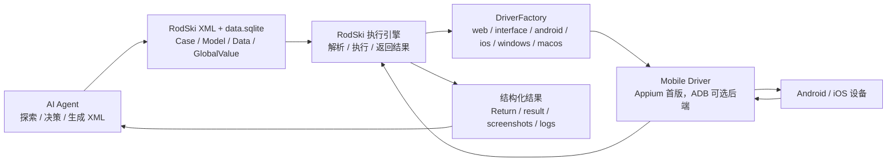
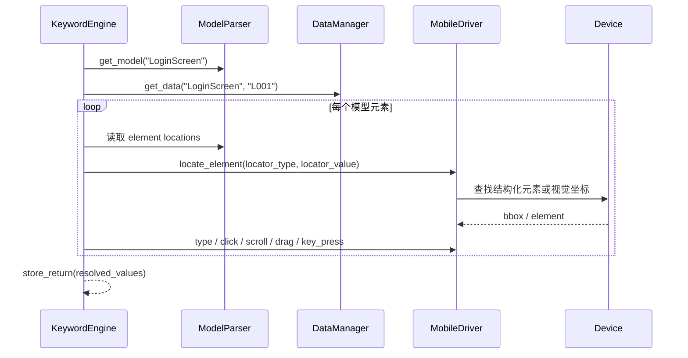

# RodSki 移动端 App 模式设计

**版本**: v1.0  
**日期**: 2026-05-19  
**目标版本**: RodSki v7.0.0  
**状态**: P0-P3 已实现（v7.0.0）；真机验收通过（华为 NTH-AN00 Android 14）  
**输入来源**: `.pb/tmp/chat_mobile_design_20260518.md`  
**约束基准**: `rodski/docs/CORE_DESIGN_CONSTRAINTS.md` v7.0.0

本文档把 2026-05-18 关于移动端 App 自动化的讨论整理为后续 RodSki 设计文档。设计目标是补齐 Android / iOS 原生 App 执行能力，同时严格保持 RodSki 的核心定位：Agent 负责探索、决策和生成 XML；RodSki 负责解析 XML、执行确定性动作并返回结构化结果。

本文档描述的是 v7.0.0 目标设计和分阶段落地边界。P0/P1 已开始接入 XML Schema、driver_type、DriverFactory、KeywordEngine 路由和 Appium 文本读取；但在 Android/iOS 真机或模拟器上完成 demo 执行前，移动端 App 模式仍不能判定为动态验收通过。

---

## 1. 设计结论

移动端 App 模式不引入第二套 DSL，不新增 `swipe`、`long_press`、`press_keycode`、`hide_keyboard` 等 Case XML `action`。App 自动化继续使用 RodSki 三元模型：

```text
用例 = 关键字 + 模型 + 数据
```

移动端 App 的目标表达方式如下：

| 维度 | 设计结论 |
|------|----------|
| 平台标识 | 在 `model.xml` 使用 `driver_type="android"` 或 `driver_type="ios"` |
| 启动 / 切换 | 使用 `navigate`，不使用 `launch` |
| UI 输入与操作 | 使用 `type` 批量模式 |
| UI 验证 | 使用 `verify` 批量模式，读取移动端 UI 实际值 |
| 接口测试 | 仍使用 `send` + `verify`，不与 App UI 驱动混用 |
| 特殊移动操作 | 优先映射到已有数据字段动作；无法覆盖时用 `run` 调用 `fun/` 脚本 |
| 视觉定位 | 复用 `vision` / `ocr` / `vision_bbox` 定位器类型 |
| Agent 协作 | Agent 探索设备并生成 XML；RodSki 只执行 XML |

---

## 2. 必须遵守的核心约束

### 2.1 不新增 Case action

Case XML 的 `action` 仍只能使用 `case.xsd` 中已有关键字。移动端专有能力不得扩展成以下动作：

```xml
<!-- 禁止 -->
<test_step action="swipe" model="HomeScreen" data="S001"/>
<test_step action="long_press" model="HomeScreen" data="L001"/>
<test_step action="press_keycode" model="" data="4"/>
<test_step action="hide_keyboard" model="" data=""/>
```

移动端 UI 行为必须通过已有关键字表达：

```xml
<!-- 允许：启动 / 切换移动端目标 -->
<test_step action="navigate" model="" data="GlobalValue.Mobile.AppTarget"/>

<!-- 允许：批量输入、点击、滚动等 UI 操作 -->
<test_step action="type" model="LoginScreen" data="L001"/>

<!-- 允许：批量验证 -->
<test_step action="verify" model="LoginScreen" data="V001"/>

<!-- 允许：内置关键字覆盖不了时调用脚本 -->
<test_step action="run" model="" data="fun/mobile/android_keycode.py 4"/>
```

### 2.2 UI 原子动作写在数据字段值中

移动端操作必须沿用 `type` 批量模式。字段名来自模型元素名，字段值表达动作或输入内容。

| 移动端意图 | 允许的数据字段值 | 说明 |
|------------|------------------|------|
| 点击 / tap | `click` | 点击元素中心点 |
| 输入文本 | 任意文本 | 默认写入到目标输入元素 |
| 滚动 | `scroll` / `scroll【x,y】` | 使用核心约束已有动作，不新增 `swipe` |
| 拖动 | `drag【目标元素名】` | 从当前元素拖到目标元素 |
| 按键 | `key_press【按键】` | 如 `key_press【BACK】`、`key_press【ENTER】` |
| 下拉选择 | `select【值】` | 仅在目标控件可确定性选择时使用 |

`long_press`、`hide_keyboard`、复杂 keycode、系统级设置、跨 App 分享等行为，首版不新增 DSL。若已有字段动作无法准确表达，使用 `run` 调用 `fun/mobile/` 下的 Python 脚本。后续若确需新增数据字段动作，必须先修改核心约束和用例编写指南；即使新增，也只能作为数据字段值，不能成为 Case XML 的 `action`。

### 2.3 模型名、字段名和数据表名保持一致

移动端 App 模式不改变数据契约：

| 项目 | 约束 |
|------|------|
| 模型名 | 必须匹配 `data.sqlite` 逻辑表名 |
| 元素名 | 必须与数据字段名完全一致，区分大小写 |
| 输入数据 | 表名为 `{ModelName}`，`table_kind='data'` |
| 验证数据 | 表名为 `{ModelName}_verify`，`table_kind='verify'` |
| Case data | 只写 `DataID`，不写 `ModelName.DataID` |
| 数据文件 | 只使用 `data/data.sqlite`，不恢复 `data.xml` |
| 全局变量 | 继续使用 `data/globalvalue.xml` |

---

## 3. 当前状态和差距

当前仓库已经有移动端驱动基础，但还不能形成符合 RodSki 协议的完整 App 模式。

| 已有基础 | 当前差距 | v7.x 目标 |
|----------|----------|-----------|
| `AppiumDriver` / `AndroidDriver` / `IOSDriver` 类已存在 | v7.0.0-draft 已将 `android` / `ios` 接入 `DriverFactory` | 后续补齐设备配置、Appium capability 和真机验收 |
| Appium 旧 API 支持 `click("id=xxx")`、`swipe()` 等 | 与 BaseDriver 两阶段定位接口并存，模型定位器未统一 | 内部统一到 `<location type="...">` + BaseDriver 坐标接口 |
| `model.xsd` 支持 `driver_type` | v7.0.0-draft 已加入 `android` / `ios` 枚举 | 保持 Schema、解析器、文档和 demo 同步 |
| `type` 已有批量 UI 输入语义 | 移动端滚动、按键、拖拽映射不完整 | 通过已有字段动作适配移动端执行 |
| `verify` 是通用验证关键字 | v7.0.0-draft 已让 AppiumDriver 尝试从元素属性和 bbox 读取文本 | 后续补齐 OCR / 视觉后端读取和真实设备验证 |
| RodSki 已有视觉定位器 | 移动端截图、坐标归一化和 OCR 读取未形成契约 | `vision` / `ocr` / `vision_bbox` 可用于 Android / iOS |
| 单元测试已有 mock Appium 驱动 | `rodski-demo/` 没有 App 示例 | 增加真实结构的移动端 demo 验收链路 |

---

## 4. 目标架构

### 4.1 系统边界



RodSki 的 durable facts 仍然是 XML、SQLite 数据、结果、日志和截图。Agent 可以探索设备、分析失败、生成或修复 XML，但不能绕过 RodSki 直接把临时策略写进执行引擎，也不能让 RodSki 承担业务规划。

### 4.2 组件职责

| 组件 | 允许做什么 | 不允许做什么 |
|------|------------|--------------|
| rodski-agent | 探索 App、识别元素、生成 model/case/data、分析执行结果 | 把 Agent 决策逻辑塞进 RodSki 核心执行路径 |
| Case XML | 声明步骤顺序和关键字 | 写移动端专用 action 或旧 locator 字符串 |
| model.xml | 声明模型、driver_type、元素定位器 | 使用废弃的 `locator="..."` 或 `type="locator" value="..."` 格式 |
| data.sqlite | 保存输入值、字段动作、验证期望值 | 用 `data.xml` / `data_verify.xml` 恢复旧数据模式 |
| KeywordEngine | 根据关键字和模型类型路由到对应驱动 | 根据 UI 状态自主规划下一步 |
| MobileDriver | 根据定位器执行坐标操作、读取 UI 实际值、截图 | 解析业务流程或改变步骤顺序 |
| `run` 脚本 | 处理内置关键字覆盖不了的设备动作 | 取代主路径关键字体系 |

---

## 5. XML 协议设计

### 5.1 model.xml

移动端模型使用 `type="ui"`，通过 `driver_type` 指定平台。

```xml
<?xml version="1.0" encoding="UTF-8"?>
<models>
  <model name="LoginScreen" type="ui" driver_type="android">
    <element name="phone">
      <type>input</type>
      <location type="id" priority="1">com.example:id/phone</location>
      <location type="ocr" priority="2">手机号</location>
    </element>

    <element name="password">
      <type>input</type>
      <location type="id" priority="1">com.example:id/password</location>
      <location type="ocr" priority="2">密码</location>
    </element>

    <element name="loginBtn">
      <type>button</type>
      <location type="id" priority="1">com.example:id/login</location>
      <location type="ocr" priority="2">登录</location>
      <location type="vision_bbox" priority="3">220,680,520,752</location>
    </element>

    <element name="welcomeText">
      <type>text</type>
      <location type="ocr">欢迎</location>
    </element>
  </model>
</models>
```

v7.0.0-draft 已在 `rodski/schemas/model.xsd` 中增加：

```xml
<xs:enumeration value="android"/>
<xs:enumeration value="ios"/>
```

并同步修改 `ModelParser` 的合法 driver_type 集合。示例仍默认 `execute="否"`，直到具备设备环境并实际跑通后才能作为动态验收证据。

### 5.2 移动端定位器映射

移动端首版不新增 LocatorType，复用当前 12 种定位器。无法适配的定位器由驱动明确返回不支持，再由多定位器机制尝试下一个定位器。

| LocatorType | Android 建议映射 | iOS 建议映射 | 说明 |
|-------------|------------------|--------------|------|
| `id` | resource-id / Appium ID | name / accessibility id / Appium ID | 优先用于稳定控件 |
| `name` | content-desc / accessibility id | accessibility id / name | 复用现有类型，不新增 `accessibility_id` |
| `text` | visible text / UiAutomator text | label / value / name 文本匹配 | 结构化文本优先，失败可用 `ocr` |
| `class` | native class name | native class name | 适合低层控件定位 |
| `xpath` | native XPath | native XPath | 可用但不推荐作为首选 |
| `vision` | 截图模板或语义视觉定位 | 截图模板或语义视觉定位 | 作为视觉定位器，不是关键字 |
| `ocr` | 设备截图 OCR | 设备截图 OCR | 适合可见文字控件 |
| `vision_bbox` | 设备截图坐标 | 设备截图坐标 | Agent 探索后固化的坐标 |
| `css` / `tag` | WebView 上下文可用 | WebView 上下文可用 | 原生上下文默认不支持 |
| `static` / `field` | 不用于 UI 定位 | 不用于 UI 定位 | 保留给接口模型 |

移动端 `vision_bbox` 的坐标基准为当前设备截图坐标系。驱动层必须在一个位置完成截图坐标到 tap/type 坐标的归一化，避免业务代码和关键字引擎散落坐标换算。

### 5.3 case.xml

移动端用例仍然使用三阶段结构。

```xml
<?xml version="1.0" encoding="UTF-8"?>
<cases tags="mobile,android,smoke">
  <case execute="是" id="APP001" title="Android App 登录" component_type="界面" priority="P0">
    <pre_process>
      <test_step action="navigate" model="" data="GlobalValue.Mobile.AppTarget"/>
    </pre_process>

    <test_case>
      <test_step action="type" model="LoginScreen" data="L001"/>
      <test_step action="verify" model="LoginScreen" data="V001"/>
    </test_case>

    <post_process>
      <test_step action="close" model="" data=""/>
    </post_process>
  </case>
</cases>
```

约束说明：

| 项目 | 规则 |
|------|------|
| `navigate` | Web / Mobile 使用；Desktop 才使用 `launch` |
| `type` | 读取 `LoginScreen` 逻辑表中的 `L001` 数据行 |
| `verify` | 自动读取 `LoginScreen_verify` 逻辑表中的 `V001` 数据行 |
| `data` | 只写 `DataID`，不写 `LoginScreen.L001` |
| `component_type` | 仍使用 `界面` |

### 5.4 globalvalue.xml

移动端环境配置继续放在 `data/globalvalue.xml`。以下是建议结构，最终字段名可在 v7 实现时固化。

```xml
<?xml version="1.0" encoding="UTF-8"?>
<globalvalue>
  <group name="Mobile">
    <var name="Platform" value="android"/>
    <var name="AppiumServer" value="http://127.0.0.1:4723"/>
    <var name="DeviceName" value="Android"/>
    <var name="AppTarget" value="app://android/com.example/.MainActivity"/>
    <var name="WaitTime" value="2"/>
  </group>
</globalvalue>
```

`navigate` 在移动端的 `data` 可以指向一个确定性的目标字符串。建议支持以下优先级：

| 目标格式 | 用途 |
|----------|------|
| `https://...` | 移动浏览器或 WebView 深链 |
| `scheme://...` | App deep link |
| `app://android/{package}/{activity}` | Android 原生 App 启动目标 |
| `app://ios/{bundleId}` | iOS 原生 App 启动目标 |

由于当前核心约束把 `navigate` 参数描述为 URL 地址，v7 实现前需要在 `CORE_DESIGN_CONSTRAINTS.md` 中明确 Mobile `navigate` 可接受 URI 风格的 App 启动目标。该扩展不能改成 `launch`，因为核心约束已经规定 Web/Mobile 不使用 `launch`。

### 5.5 data.sqlite 逻辑表

移动端数据必须进入 `data/data.sqlite`。文档中只展示逻辑表形态，不恢复 XML 数据文件。

`LoginScreen` 输入数据表：

| DataID | phone | password | loginBtn | remark |
|--------|-------|----------|----------|--------|
| L001 | 13800000000 | demo123.Password | click | 正常登录 |

`LoginScreen_verify` 验证数据表：

| DataID | phone | password | loginBtn | welcomeText | remark |
|--------|-------|----------|----------|-------------|--------|
| V001 | NONE | NONE | NONE | 欢迎 | 登录成功 |

说明：

| 字段值 | 语义 |
|--------|------|
| `click` | 在 `type` 步骤中点击元素 |
| `.Password` 后缀 | 输入真实值，日志脱敏 |
| `NONE` | 对应字段跳过，不发送、不输入或不验证 |
| `BLANK` | UI 输入跳过；verify 中表示期望空字符串 |

---

## 6. navigate 在移动端的语义

`navigate` 在移动端负责启动或切换到目标 App / 页面。它与 Web 的 `navigate` 保持同一个 Case action，但由 DriverFactory 和 MobileDriver 根据目标和配置执行不同的确定性动作。

### 6.1 行为规则

| 场景 | 行为 |
|------|------|
| 当前没有移动端 driver | 根据 GlobalValue / CLI 配置创建 `android` 或 `ios` driver |
| driver 已存在 | 复用当前会话，切换到目标 App 或 deep link |
| 目标是 HTTP URL | 可打开浏览器、WebView 或由移动端驱动处理的 URL |
| 目标是 App URI | Android 启动 package/activity；iOS 启动 bundleId |
| 启动失败 | 返回明确 DriverError，结果中保留设备、目标和错误摘要 |

### 6.2 配置来源优先级

建议 v7 实现采用以下优先级：

1. CLI 参数或运行配置中显式传入的 mobile capability。
2. `data/globalvalue.xml` 中 `Mobile` 组配置。
3. 驱动默认值，仅用于本地 demo 和单元测试。

不得把移动端能力配置写入 Case XML 的非标准属性，也不得把 capability 混入 `data` 字段造成不可解析的临时语法。

---

## 7. type 在移动端的语义

`type` 仍然是 UI 批量输入关键字。KeywordEngine 遍历模型元素，读取同名数据字段，再由 MobileDriver 执行动作。

### 7.1 执行流程



### 7.2 字段动作适配

| 字段值 | MobileDriver 行为 |
|--------|-------------------|
| 普通文本 | tap 元素中心，输入文本 |
| `click` | tap 元素中心 |
| `scroll` | 按默认方向滚动当前屏幕或目标容器 |
| `scroll【x,y】` | 按显式偏移滚动 |
| `drag【target】` | 定位当前元素和 target 元素，执行拖拽 |
| `key_press【BACK】` | Android 调 keycode 或 iOS 对应系统返回行为 |
| `select【value】` | 对可选择控件执行确定性选择 |
| `NONE` / `NULL` | 跳过 UI 操作 |
| `BLANK` | 跳过 UI 操作 |

实现时应把字段值解析逻辑保持在现有 `_execute_element_action` 路径中扩展，避免出现移动端专用的第二套批量输入逻辑。

---

## 8. verify 在移动端的语义

`verify` 在移动端 UI 模型下从 App 界面读取实际值，与 `{ModelName}_verify` 逻辑表中的期望值逐字段严格比较。

### 8.1 实际值读取顺序

建议 MobileDriver 对一个元素按以下顺序读取实际值：

1. 结构化元素文本：`text`、`value`、`label`、`name`、`content-desc` 等平台属性。
2. 可见性或状态类字段：当元素类型明确为开关、复选、按钮状态时，读取 selected / checked / enabled。
3. OCR 读取：当定位器为 `ocr`、`vision`、`vision_bbox` 或结构化文本为空时，对元素区域或屏幕区域做 OCR。
4. 无法读取时返回明确错误，不再静默返回空字符串。

P0/P1 阶段已让 `AppiumDriver.get_text()` 尝试通过 bbox 匹配元素，并读取 `text`、`value`、`label`、`name`、`content-desc` 等属性。后续仍需要补齐 OCR / 视觉后端读取，并用真实设备验证断言链路。

### 8.2 严格匹配

移动端 `verify` 不改变 RodSki 的严格匹配规则：

| 规则 | 说明 |
|------|------|
| 字段集合 | `_verify` 表字段必须与模型元素对齐；缺字段报错 |
| `NONE` | 跳过该字段验证 |
| `BLANK` | 期望空字符串 |
| 不一致 | 任一字段不一致，步骤失败，case FAIL |
| Return | `verify` 的实际值字典写入 Return |

---

## 9. 视觉定位在移动端的应用

移动端视觉定位复用现有定位器，不新增 `vision_click` 或 `vision_input`。

### 9.1 定位器职责

| 定位器 | 移动端用途 |
|--------|------------|
| `vision` | 模板图或语义视觉匹配，适用于图标、固定控件 |
| `ocr` | 文本按钮、标签、列表项 |
| `vision_bbox` | Agent 探索后记录的固定区域，性能最高 |

### 9.2 执行边界

RodSki 可以在定位阶段调用截图、OCR、OmniParser 或配置的视觉后端，但只能把结果用于定位元素。它不能根据视觉结果自主改变业务步骤、重排流程或生成新 XML。

Agent 可以使用 ADB、Accessibility Tree、截图和多模态模型探索 App，然后把稳定结果沉淀到 `model.xml`：

```xml
<location type="id" priority="1">com.example:id/login</location>
<location type="ocr" priority="2">登录</location>
<location type="vision_bbox" priority="3">220,680,520,752</location>
```

这种组合保证传统定位优先，视觉定位兜底，并且所有定位事实都保存在模型文档中。

---

## 10. 特殊移动端操作处理方案

### 10.1 首版使用既有能力

| 操作 | 首版推荐表达 | 备注 |
|------|--------------|------|
| 返回键 | `key_press【BACK】` | Android 可映射 keycode 4 |
| 回车 / 搜索 | `key_press【ENTER】` | 平台适配 |
| 隐藏键盘 | `key_press【BACK】` 或 `run fun/mobile/hide_keyboard.py` | 不新增 `hide_keyboard` action |
| 滑动页面 | `scroll` / `scroll【x,y】` | 不新增 `swipe` action |
| 拖动滑块 | `drag【targetElement】` | 需要目标元素可定位 |
| 长按 | `run fun/mobile/long_press.py ElementName` | 首版不新增数据动作 |
| Android keycode | `run fun/mobile/android_keycode.py 4` | 复杂 keycode 走脚本 |
| 系统弹窗处理 | `type` + 视觉/文本定位，或 `run` 脚本 | 仍保留步骤显式性 |

### 10.2 run 脚本约束

移动端 `run` 脚本必须放在测试模块 `fun/` 目录下，并通过 stdout 返回结构化结果。脚本是扩展能力，不是新的 App 自动化 DSL。

```xml
<test_step action="run" model="" data="fun/mobile/android_keycode.py 4"/>
```

脚本返回建议：

```json
{"status": "success", "operation": "android_keycode", "keycode": 4}
```

---

## 11. 与 rodski-agent 的协作模式

### 11.1 责任分工

| 阶段 | Agent 职责 | RodSki 职责 |
|------|------------|-------------|
| 探索 | 连接设备、截图、读取 Accessibility Tree、识别元素 | 不参与业务探索 |
| 生成 | 生成 `case.xml`、`model.xml`、`data.sqlite` 逻辑表和 `globalvalue.xml` | 提供校验工具 |
| 执行 | 调用 `rodski run` | 解析 XML 并确定性执行 |
| 诊断 | 根据结果、截图、日志判断修复方案 | 返回结构化错误和证据 |
| 修复 | 更新 XML / 数据 / 定位器 | 不自主改写用例 |

### 11.2 Agent 生成策略

Agent 生成移动端 XML 时应遵循：

1. 优先使用稳定结构化定位器：`id`、`name`、`text`。
2. 对动态或跨版本 UI 增加 `ocr` / `vision_bbox` 兜底。
3. Case XML 只写关键字和 DataID，不写定位器和动作细节。
4. 数据表中字段集合与模型元素完全一致。
5. 移动端特殊动作先尝试已有字段动作，复杂动作显式用 `run`。
6. 失败后重新探索并更新 `model.xml`，不要让 RodSki 自动猜测业务路径。

---

## 12. 实现路线图

### P0：协议和驱动接入

目标：让 `driver_type="android"` / `driver_type="ios"` 成为合法、可路由的 UI 驱动类型。

必须改动：

| 文件 / 模块 | 改动 |
|-------------|------|
| `rodski/schemas/model.xsd` | `DriverType` 增加 `android`、`ios` |
| `rodski/core/model_parser.py` | 合法 driver_type 集合增加 `android`、`ios` |
| `rodski/core/driver_factory.py` | `SUPPORTED_DRIVER_TYPES` 增加 `android`、`ios`，创建 `AndroidDriver` / `IOSDriver` |
| `rodski/core/keyword_engine.py` | 增加移动端驱动路由，`type` / `verify` 使用模型 driver_type |
| `rodski/drivers/appium_driver.py` | 统一 BaseDriver 两阶段定位接口，保留旧 API 仅作内部兼容 |
| `rodski/docs/CORE_DESIGN_CONSTRAINTS.md` | 更新 Mobile driver_type 和 `navigate` App URI 语义 |
| `rodski/docs/TEST_CASE_WRITING_GUIDE.md` | 增加移动端 App 编写规范 |

验收：

| 类型 | 要求 |
|------|------|
| 单元测试 | DriverFactory、ModelParser、KeywordEngine 路由、AppiumDriver mock |
| Schema 校验 | 含 `driver_type="android"` 的 model.xml 可通过 XSD |
| demo 预留 | `rodski-demo/DEMO/mobile_app/` 形成标准目录骨架 |

### P1：移动端 verify 和定位器

目标：移动端 `verify` 可读取实际值，并支持多定位器兜底。

必须改动：

| 模块 | 改动 |
|------|------|
| `AppiumDriver.locate_element` | 映射 `id` / `name` / `text` / `class` / `xpath` |
| `AppiumDriver.get_text` | 返回真实元素文本或 OCR 结果，不再返回空字符串 |
| 视觉定位模块 | 支持移动端截图输入和坐标归一化 |
| 错误处理 | 元素找不到、文本无法读取、OCR 失败要返回明确错误 |

验收：

| 类型 | 要求 |
|------|------|
| 单元测试 | mock 元素属性读取、locator fallback、verify mismatch |
| demo | 登录成功文本验证或设置页文本验证 |

### P2：移动端字段动作适配

目标：让 `type` 批量模式覆盖常见移动端 UI 动作。

必须支持：

| 字段值 | 行为 |
|--------|------|
| `click` | tap |
| 普通文本 | tap + 输入 |
| `scroll` / `scroll【x,y】` | 滑动屏幕或目标区域 |
| `drag【target】` | 拖拽 |
| `key_press【BACK】` / `key_press【ENTER】` | 平台按键 |

不在 P2 中新增：

| 不新增项 | 替代方案 |
|----------|----------|
| `swipe` action | `scroll` 字段动作 |
| `long_press` action | `run` |
| `hide_keyboard` action | `key_press【BACK】` 或 `run` |
| `press_keycode` action | `run` |

### P3：官方 demo 验收链路

目标：补齐 `rodski-demo` 中的移动端 App 示例。

建议目录：

```text
rodski-demo/DEMO/mobile_app/
├── case/
│   └── login.xml
├── model/
│   └── model.xml
├── fun/
│   └── mobile/
├── data/
│   ├── data.sqlite
│   └── globalvalue.xml
├── plan/
│   └── project_full.xml
└── result/
```

如果 CI 没有真机或模拟器，demo 可以先包含 `execute="否"` 的示例，但不能把它算作动态验收通过。真正完成必须在具备设备环境时执行通过。

### P4：rodski-agent 移动端生成能力

目标：Agent 能从自然语言需求生成移动端 RodSki 模块。

能力范围：

| 能力 | 说明 |
|------|------|
| 设备探索 | ADB / Appium / Accessibility Tree / 截图 |
| 元素识别 | 生成 `id` / `name` / `ocr` / `vision_bbox` 多定位器 |
| 用例生成 | 生成标准三阶段 Case XML |
| 数据生成 | 写入 `data.sqlite` 逻辑表 |
| 失败修复 | 根据 RodSki 结果更新定位器或数据 |

Agent 不应绕过 `data.sqlite` 直接生成旧 XML 数据文件。

### P5：ADB 直连可选后端

市场调研显示 Agentic 移动端工具大量使用 ADB + 截图 / Accessibility Tree，不强依赖 Appium。RodSki 可以在 v7.x 后续阶段引入 ADB 直连后端，但必须保持外部协议不变：

| 约束 | 要求 |
|------|------|
| 不新增关键字 | 仍使用 `navigate` / `type` / `verify` / `run` |
| 不新增 DSL | `model.xml` 和 `data.sqlite` 不变 |
| 后端可替换 | `android` driver 可由 Appium 或 ADB backend 实现 |
| 结果一致 | Return、日志、截图路径、错误类型保持兼容 |

---

## 13. 合规性检查清单

后续实现移动端 App 模式时，每个 PR 必须逐项检查：

| 检查项 | 要求 |
|--------|------|
| 关键字集合 | 不新增 `swipe`、`long_press`、`press_keycode`、`hide_keyboard` 等 action |
| UI 原子动作 | 只写在数据字段值中，由 `type` 批量模式执行 |
| App 启动 | Mobile 使用 `navigate`，不使用 `launch` |
| 模型格式 | 只使用 `<location type="...">值</location>` |
| driver_type | `android` / `ios` 必须同步更新 XSD、解析器、文档 |
| 定位器 | 首版复用现有 12 种 LocatorType，不新增 `accessibility_id` |
| 视觉定位 | 作为定位器类型，不作为关键字 |
| 数据文件 | 只使用 `data/data.sqlite` 和 `data/globalvalue.xml` |
| 验证数据 | 使用 `{ModelName}_verify` 逻辑表 |
| Return | 不在 Case XML 的 `data` 属性中写 `${Return[...]}` |
| Agent 边界 | RodSki 不做探索、规划、对话管理或策略编排 |
| 特殊动作 | 内置关键字覆盖不了时用 `run` 调 `fun/` 脚本 |
| 验收 | 单元测试之外，必须补齐 `rodski-demo` 真实结构用例 |

---

## 14. 后续文档同步点

当 v7.x 开始实现移动端 App 模式时，需要同步更新：

| 文档 | 更新内容 |
|------|----------|
| `CORE_DESIGN_CONSTRAINTS.md` | 增加移动端 driver_type、`navigate` App URI 语义、移动端字段动作边界 |
| `TEST_CASE_WRITING_GUIDE.md` | 增加 Android / iOS model、case、data.sqlite 示例 |
| `VISION_LOCATION.md` | 增加移动端截图坐标、OCR、视觉定位说明 |
| `AGENT_INTEGRATION.md` | 增加移动端 Agent 探索和 XML 生成策略 |
| `API_REFERENCE.md` / `SKILL_REFERENCE.md` | 如 CLI 或关键字说明发生变化，同步更新 |
| `README.md` | 更新支持矩阵和快速入口 |

---

## 15. 非目标

以下内容不属于移动端 App 模式首版目标：

1. 不把 RodSki 改造成移动端 Agent 框架。
2. 不在 RodSki 内部加入业务路径规划。
3. 不恢复 `data.xml` / `data_verify.xml`。
4. 不新增移动端专用 Case action。
5. 不新增一套自然语言动作语法。
6. 不承诺所有 Appium 能力都成为 RodSki 内置能力。
7. 不在没有 XSD 和 demo 验收的情况下宣布协议已生效。

---

## 16. 推荐的第一批实施任务

1. 更新 `model.xsd` 和 `ModelParser`，让 `android` / `ios` 成为合法 `driver_type`。
2. 更新 `DriverFactory`，接入 `AndroidDriver` / `IOSDriver`，并支持从配置创建 capability。
3. 更新 `KeywordEngine._get_driver_for_type`，增加移动端 driver 缓存与路由。
4. 修复 `AppiumDriver.get_text()`，让移动端 `verify` 具备真实断言能力。
5. 把 Appium 旧 locator string API 收敛到 `<location type="...">` 解析后的内部实现。
6. 增加 `scroll`、`drag`、`key_press` 字段动作在移动端的确定性映射。
7. 创建 `rodski-demo/DEMO/mobile_app/` 标准模块和 README，记录设备前置条件。
8. 补充单元测试和至少一个可在本地设备执行的 demo 验收用例。

---

## 17. iOS Simulator 验收（WI-55，v7.2.x）

本章记录 iOS Simulator 端到端验收的完整链路、已修复的兼容性问题和跨平台 model 写法。

### 17.1 验收结论

**验收结果**：3/3 用例通过（APP001 / APP002 / APP003），所有核心路径（navigate → type → verify）在 iPhone 16 Simulator (iOS 18.5) 上实际执行通过。

**验收日期**：2026-06-09  
**Xcode**：16.4  
**Appium**：3.4.2  
**xcuitest driver**：11.9.1  
**appium-python-client**：5.3.1  

### 17.2 环境前置条件

| 依赖 | 安装方式 | 验证命令 |
|------|---------|---------|
| Xcode 15+ | App Store | `xcodebuild -version` |
| xcodegen（可选，已有 .xcodeproj 时不需要） | `brew install xcodegen` | `xcodegen --version` |
| Node.js | `brew install node` | `node --version` |
| Appium 2.x | `npm install -g appium` | `appium --version` |
| xcuitest driver | `appium driver install xcuitest` | `appium driver list --installed` |
| appium-python-client 5.x | `pip install Appium-Python-Client` | `pip show Appium-Python-Client` |

**一键环境准备脚本**：

```bash
bash rodski-demo/DEMO/mobile_app/scripts/setup_ios.sh
```

该脚本完成：Xcode/Appium/xcuitest 检查 → 启动 iPhone 16 Simulator → 构建并安装 demo_ios_app → 提示启动 Appium server。

### 17.3 跨平台 model 写法

iOS 复用与 Android 相同的 model.xml，通过 `location platform="ios"` 属性区分平台定位器。模型 `driver_type="mobile"` 表示平台无关；运行时通过 `globalvalue.xml Mobile.Platform` 解析为具体平台。

```xml
<model name="LoginScreen" type="ui" driver_type="mobile" servicename="">
  <element name="username" type="mobile">
    <type>input</type>
    <!-- Android 专用 -->
    <location type="id" platform="android" priority="1">com.rodski.demo:id/username</location>
    <!-- iOS 专用（accessibility identifier） -->
    <location type="id" platform="ios" priority="1">username_field</location>
    <!-- 通用兜底（无 platform，任何平台保留） -->
    <location type="ocr" priority="2">用户名</location>
  </element>
</model>
```

**平台过滤规则**（`ModelParser.select_locations`）：

| location.platform | current_platform | 保留？ |
|-------------------|-----------------|--------|
| `android` | `ios` | 跳过 |
| `ios` | `android` | 跳过 |
| `android` | `android` | 保留 |
| `ios` | `ios` | 保留 |
| `None`（无声明） | 任意 | 始终保留（向后兼容） |

### 17.4 iOS 专用定位器类型

IOSDriver（`rodski/drivers/ios_driver.py`）支持以下全部定位器：

| type | Appium By | 说明 |
|------|-----------|------|
| `id` | `ACCESSIBILITY_ID` | SwiftUI `accessibilityIdentifier`（推荐首选） |
| `name` | `NAME` | 元素 name 属性 |
| `class` | `CLASS_NAME` | 原生类名（XCUIElementTypeButton 等） |
| `xpath` | `XPATH` | 原生 XPath（功能全但较慢） |
| `predicate` | `IOS_PREDICATE` | NSPredicate 字符串，性能优于 XPath |
| `class_chain` | `IOS_CLASS_CHAIN` | XCUITest 原生路径，速度最快 |

SwiftUI 项目推荐以 `accessibilityIdentifier` 为主定位器（对应 `type="id"`），配合 `predicate` 作为 P2 兜底。

### 17.5 globalvalue.xml 双配置方案

项目保留两个 globalvalue 文件以支持双平台切换：

| 文件 | 用途 |
|------|------|
| `data/globalvalue.xml` | Android 默认配置（CI 和真机验收） |
| `data/globalvalue_ios.xml` | iOS 配置（Simulator 验收参考） |

**方案一：临时覆盖文件**（适合本地验证）

```bash
cp data/globalvalue_ios.xml data/globalvalue.xml
rodski run case/login.xml
```

**方案二：CLI `--platform` 参数覆盖**（无需改文件，推荐）

```bash
# 仍使用 globalvalue_ios.xml 作为 globalvalue.xml 时（包含 BundleId 等 iOS caps）
rodski run @ios_app_smoke --platform ios
```

注意：`--platform` 只覆盖 `Mobile.Platform`，不覆盖 `BundleId` / `AppPackage` 等 capability。如需同时切换设备配置，仍需使用 `globalvalue_ios.xml`。

**globalvalue_ios.xml 关键字段**：

```xml
<group name="Mobile">
  <var name="Platform" value="ios"/>
  <var name="AppiumServer" value="http://127.0.0.1:4723"/>
  <var name="DeviceName" value="iPhone 16"/>
  <var name="BundleId" value="com.rodski.demo"/>
  <var name="AppTarget" value="app://ios/com.rodski.demo"/>
  <var name="NoReset" value="true"/>
  <var name="NewCommandTimeout" value="120"/>
</group>
```

### 17.6 iOS 冒烟测试计划

```bash
# 使用 globalvalue_ios.xml 作为活跃 globalvalue
cp data/globalvalue_ios.xml data/globalvalue.xml

# 启动 Appium server（另一个终端）
appium --address 127.0.0.1 --port 4723

# 运行 iOS 冒烟计划（APP001/APP002/APP003）
cd rodski-demo/DEMO/mobile_app
rodski run @ios_app_smoke
```

计划文件：`plan/ios_app_smoke.xml`（`kind=suite`，`default_execute="否"`，显式列出 APP001/APP002/APP003）。

### 17.7 已修复的兼容性问题（appium-python-client 5.x）

在 WI-55 中发现并修复了两处与 appium-python-client 5.3.x 的兼容性问题：

**问题1：XCUITestOptions 导入路径变更**

- 文件：`rodski/drivers/ios_driver.py`
- 现象：`from appium.options import XCUITestOptions` 在 5.x 中 ImportError
- 修复：优先尝试 `from appium.options.ios.xcuitest.base import XCUITestOptions`，失败则 fallback 到旧路径

**问题2：`get_element_text_by_locator` 裸 core 导入**

- 文件：`rodski/drivers/appium_driver.py`
- 现象：`from core.exceptions import ElementNotFoundError`（bare import）在 rodski 包模式下 ModuleNotFoundError
- 修复：改为 `from ..core.exceptions import ElementNotFoundError`，并保留 ImportError fallback

### 17.8 WDA 首次编译说明

xcuitest driver 首次连接 Simulator 时需要编译 WebDriverAgent（WDA），耗时约 60~120 秒，属正常现象。编译完成后会缓存，后续启动约 5~15 秒。

```
navigate 耗时 79.50s   ← 第一次（含 WDA 编译）
navigate 耗时 7.79s    ← 后续（缓存复用）
```

CI 集成建议：首次构建允许 3 分钟超时；正常执行超时设 60 秒。


这批任务完成后，RodSki 才能把移动端 App 模式从设计稿提升为可执行协议。
